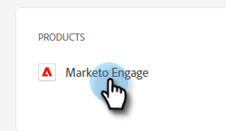

# Een gebruiker toevoegen of verwijderen {#add-or-remove-a-user}

## Een gebruiker toevoegen {#add-a-user}

1. Login aan [ Adobe Admin Console ](https://adminconsole.adobe.com/) {target="_blank"}.

   

1. Klik **Marketo Engage**.

   

1. Selecteer het gewenste abonnement (als u meerdere abonnementen hebt).

   

1. Klik op de tab **[!UICONTROL Users]** .

   

1. Klik op **[!UICONTROL Add User]** .

   

1. Voer de naam, gebruikersgroep of het e-mailadres in van de gebruiker die u wilt toevoegen. Voornaam en achternaam zijn optioneel.

   

1. Klik op het pictogram **+** en selecteer het gewenste productprofiel.

   

   >[!IMPORTANT]
   >
   >Een gebruiker _moet_ aan een productprofiel worden toegevoegd om toegang tot Marketo Engage te krijgen.

1. Klik op **[!UICONTROL Save]**.

   

De gebruiker ontvangt vervolgens een e-mail om zich aan te melden bij het Marketo Engage.

>[!NOTE]
>
>Wanneer de gebruiker via de Adobe Admin Console aan het Marketo Engage wordt toegevoegd, krijgt hij of zij de rol &quot;Standaardgebruiker&quot; binnen de werkruimte Standaard van het abonnement. Als de rol van de gebruiker binnen de werkruimte moet worden aangepast, wordt dat gedaan in Marketo Engage, [ zoals hier beschreven ](/help/marketo/product-docs/administration/users-and-roles/managing-user-roles-and-permissions.md){target="_blank"}.

## Een gebruiker verwijderen {#remove-a-user}

>[!NOTE]
>
>U moet systeembeheerder zijn om een gebruiker te verwijderen.

1. Login aan [ Adobe Admin Console ](https://adminconsole.adobe.com/) {target="_blank"}.

   

1. Klik **Marketo Engage**.

   

1. Selecteer het gewenste abonnement (als u meerdere abonnementen hebt).

   

1. Klik op de tab **[!UICONTROL Users]** .

   

1. Selecteer de gebruiker die u wilt verwijderen en klik op **[!UICONTROL Remove]** .

   

1. Klik op **[!UICONTROL Remove User]** om te bevestigen.

   

De gebruiker ontvangt vervolgens een e-mail met de kennisgeving dat hij of zij geen toegang meer heeft tot het Marketo Engage.

>[!MORELIKETHIS]
>
>* [ de Gebruikers van Adobe Admin Console ](https://helpx.adobe.com/enterprise/using/users.html) {target="_blank"}
>* [ beheert Individueel Gebruikers ](https://helpx.adobe.com/enterprise/using/manage-users-individually.html) {target="_blank"}
