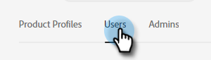

# Een gebruiker toevoegen of verwijderen {#add-or-remove-a-user}

## Een gebruiker toevoegen {#add-a-user}

1. Meld u aan bij [Adobe Admin Console](https://adminconsole.adobe.com/).

   

1. Klik **Marketo Engage**.

   

1. Selecteer het gewenste abonnement (als u meerdere abonnementen hebt).

   

1. Klik op het tabblad **Gebruikers**.

   

1. Klik op de knop **Gebruiker toevoegen**.

   

1. Voer de naam, gebruikersgroep of het e-mailadres in van de gebruiker die u wilt toevoegen. Voornaam en achternaam zijn optioneel.

   

1. Klik op het pictogram **+** en selecteer het gewenste productprofiel.

   

1. Klik **Opslaan**.

   

De gebruiker ontvangt vervolgens een e-mail om zich aan te melden bij Marketo.

## Een gebruiker verwijderen {#remove-a-user}

1. Meld u aan bij [Adobe Admin Console](https://adminconsole.adobe.com/).

   

1. Klik **Marketo Engage**.

   

1. Selecteer het gewenste abonnement (als u meerdere abonnementen hebt).

   

1. Klik op het tabblad **Gebruikers**.

   

1. Selecteer de gebruiker u wilt verwijderen en de **Remove** knoop klikken.

   

1. Klik **Verwijder Gebruiker** om te bevestigen.

   

>[!MORELIKETHIS]
>
>* [Adobe Admin Console-gebruikers](https://helpx.adobe.com/enterprise/using/users.html)
>* [Gebruikers afzonderlijk beheren](https://helpx.adobe.com/enterprise/using/manage-users-individually.html)

