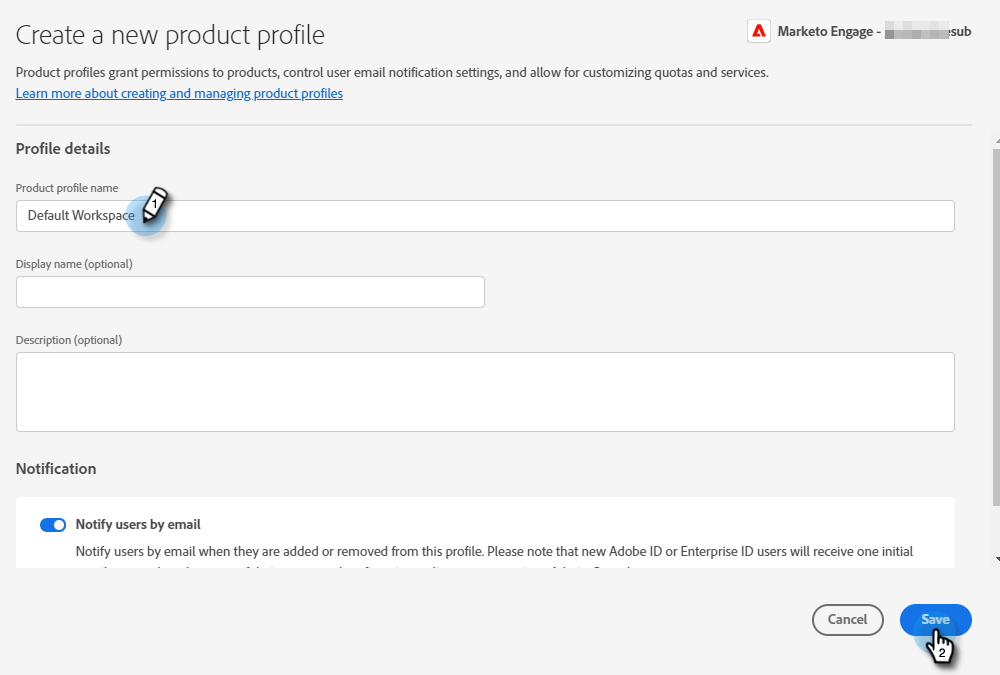

# Beheerdersinstellingen {#admin-setup}

Nadat u als Admin van het Systeem van Adobe aan Marketo Engage in Adobe org wordt toegevoegd, zijn er een paar stappen u zult moeten nemen om de aanvankelijke opstelling te voltooien.

## Eerste instelling {#initial-setup}

1. Nadat u als aangewezen Admin van het Systeem voor Marketo Engage (in een nieuwe of gevestigde org) bent toegevoegd, zult u een welkome e-mail ontvangen. Klik in die e-mail op **[!UICONTROL Get Started]** .

   

1. Als u eerder een toepassing met een Adobe ID hebt geopend, gaat u rechtstreeks naar de Adobe Admin Console. Als niet, [&#x200B; opstelling uw Adobe ID &#x200B;](https://helpx.adobe.com/nl/manage-account/using/create-update-adobe-id.html){target="_blank"}.

   

## Een productprofiel maken {#create-a-product-profile}

Nadat de systeembeheerder de Admin Console heeft geopend, is het tijd om een productprofiel te maken. Zo krijgen uw gebruikers/beheerders toegang tot Marketo Engage.

1. In de **[!UICONTROL Overview]** pagina, onder **[!UICONTROL Products and Services]**, klik **Marketo Engage**.

   

1. Kies het gewenste abonnement. Als u er maar een hebt, gaat u verder met de volgende stap.

   

   >[!NOTE]
   >
   >Als u meerdere abonnementen hebt, moeten deze stappen voor elke abonnement worden gevolgd.

1. Klik op **[!UICONTROL New Profile]** .

   

1. Geef uw productprofiel een naam (de Naam en de Beschrijving van de Vertoning zijn facultatief) en klik **[!UICONTROL Next]**.

   

1. Er hoeven geen services te worden geselecteerd. Klik op **[!UICONTROL Save]**.

>[!NOTE]
>
>Als u meerdere productprofielen instelt, hebben gebruikers dezelfde toegang tot Marketo, ongeacht het profiel waaraan ze zijn toegevoegd.

>[!MORELIKETHIS]
>
>[&#x200B; voeg of verwijder een Admin van het Product toe &#x200B;](/help/marketo/product-docs/administration/marketo-with-adobe-identity/add-or-remove-a-product-admin.md){target="_blank"}
