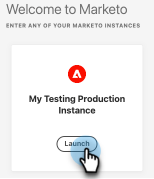

# Adobe Identity Management - Veelgestelde vragen {#adobe-identity-management-faq}

**wat is de Identiteit van de Adobe?**

Adobe Identity Management System bestaat uit drie componenten.

* [!DNL Adobe Identity Service]: handelt verificatie en validatie van de eindgebruiker af, inclusief federatie en runtime Single-Sign-On (SSO).

* Adobe Admin Console: De Admin Console biedt een centrale locatie voor het beheer van rechten voor Adoben in uw hele organisatie. Het behandelt gebruikersbeheer, de wolkendienst, de vergunning van de Desktop, federatieconfiguratie, en verstrekt de veiligheidseigenschappen van de verliespreventie.

* Gebruikerbeheer-API (UMAPI) voor Adobe: hiermee kunnen organisaties gebruikers en rechten van bedrijven in de Adobe Admin Console beheren op API-niveau.

**wanneer zullen de bestaande abonnementen van het Marketo Engage met IMS worden geïntegreerd?**

Bestaande abonnementen op Marketo&#39;s Engage worden momenteel gemigreerd naar de Adobe IMS tijdens elke verkoopgebeurtenis, waaronder verlengingen, heruitbestedingsgebeurtenissen en/of toevoegingen. Migraties buiten een verkoopgebeurtenis worden nu ondersteund vanaf oktober 2024.

**na migratie, zal Marketo Engage URLs het zelfde blijven?**

Nee. URL&#39;s zien er na de migratie anders uit.

**is er om het even wat wij moeten doen voor de verandering voorbereidingen treffen URL?**

Ja. Na de migratie gaat Marketo Engage van experience.adobe.com naar Adobe Experience Cloud. U zult met uw team van IT moeten werken om alle vermelde domeinen van de Adobe [ bij de bovenkant van dit artikel ](/help/marketo/getting-started/initial-setup/configure-protocols-for-marketo.md){target="_blank"} te lijsten van gewenste personen om verstoring aan de toegang van het Marketo Engage te verhinderen.

De vorige verbindingen en de referenties aan de activa van het Marketo Engage op het engage-xx.marketo.com domein _zullen_ blijven functioneren. U moet zich echter eerst aanmelden bij de instantie Marketo Engage voor de URL waarnaar u navigeert. Als u bijvoorbeeld naar een bladwijzer voor een slimme campagne wilt navigeren, bijvoorbeeld met Munchkin ID 123-ABC-456, moet u zich eerst aanmelden bij de instantie Marketo Engage met Munchkin ID 123-ABC-456.

**wat is het verschil tussen Admin van het Product van de Adobe en Admin van het Marketo Engage?**

* Adobe Product Admin is een nieuwe rol in het Marketo-platform.
* Adobe van productbeheerdersrol wordt toegekend aan gebruikers die als productbeheerder in Adobe Admin Console zijn toegevoegd
* De Admin van het Product van de Adobe is een read-only rol en kan niet uit Marketo Engage worden uitgegeven of worden geschrapt.
* Adobe productbeheerder heeft dezelfde rechten en rechten als standaard Marketo Admin.
* De rol van Admin van het Marketo Engage is nog Admin en aan een gebruiker in Marketo Engage verleend.

**is er om het even welke verandering in de cliëntsteun van het Beheer van de Gebruiker API?**

Ja. Degenen die aan Adobe IMS zijn aangemeld, kunnen niet alle bestaande Marketo-API&#39;s voor gebruikersbeheer gebruiken. Voor gebruiker nodig, update, en schrappingsacties, zou Adobe [ IMS APIs ](https://www.adobe.io/apis/experienceplatform/umapi-new.html) {target="_blank"} moeten worden gebruikt. Voor rolbeheer zijn de Marketo-API&#39;s voor gebruikersbeheer nog steeds van toepassing. Daarnaast zijn er geen andere wijzigingen in de Marketo REST API-clientondersteuning.

**wie contacteren wij voor steun als wij met IMS geïntegreerd zijn?**

* Migratie vóór gebruiker: de gevallen van de dossiersteun in de [ Gemeenschap van de Natie van de Marketing ](https://nation.marketo.com/t5/support/ct-p/Support) of e-mail `customercare@marketo.com`.

* De Migratie van de post-gebruiker: de gevallen van de dossiersteun in de [ Gemeenschap van de Natie van de Marketing ](https://nation.marketo.com/t5/support/ct-p/Support) of e-mail `customercare@marketo.com`.

* Voltooiing van migratie na ondersteuning: beheerders van productondersteuning kunnen zaken indienen via de portal voor ondersteuning van Experiencen League.

Als u Ultimate Success hebt, hebt u toegang tot Admin Console Migration White Glove Service. Neem contact op met het accountteam van de Adobe (uw accountmanager) voor hulp.

**als ik een Identiteit van de Adobe om tot andere toepassingen van de Adobe gebruik, kan ik dat gebruiken om tot Marketo toegang te hebben?**

Zelfs als u andere producten van de Adobe hebt, kunt u geen toegang tot Marketo met de Identiteit van de Adobe tot het abonnement aan IMS wordt gemigreerd.

**worden Marketo gebruikersrollen (binnen werkruimten) beheerd in Adobe Admin Console?**

Nee. Het beheer van de Rol van de gebruiker (binnen werkruimten) wordt voltooid in Marketo Engage.

**ik ben Marketo Admin in een geïntegreerd abonnement IMS en heb geen toegang tot de Admin Console. Hoe krijg ik toegang?**

Om het even welk Systeem van de Adobe of Admin van het Product dat toegang tot de Admin Console van uw organisatie heeft kan u toegang geven. Als u niet zeker bent wie in uw organisatie beheerdervoorrechten in de console heeft, contacteer ](https://helpx.adobe.com/contact.html) {target="_blank"} de Zorg van de Klant van de Adobe 1} [.

**hoe Admin gebruikers aan Marketo [!DNL Sales Connect] zou toevoegen?**

Hoewel er een productkaart in Admin Console voor [!DNL Sales Connect] zal zijn, zou de Admin Console niet moeten worden gebruikt om gebruikers toe te voegen/te beheren. De volgende verbinding zal Admins toestaan om gebruikers via Marketo [!DNL Sales Connect] te beheren: [ https://toutapp.com/next#settings/admin/user-management ](https://toutapp.com/next#settings/admin/user-management) {target="_blank"}.

**waar kan ik meer over Adobe Admin Console leren?**

[ https://helpx.adobe.com/enterprise/admin-guide.html ](https://helpx.adobe.com/nl/enterprise/admin-guide.html) {target="_blank"}.

**ga ik nog naar de Admin sectie in Marketo om gebruikersrekeningsveranderingen voor mijn rekening aan te brengen?**

Nr, zou u aan [ account.adobe.com ](https://account.adobe.com) {target="_blank"} moeten navigeren.

**hoe werkt dit met universele identiteitskaart van Marketo?**

Degenen die zich aan de Adobe-identiteit houden, hebben naadloos toegang tot alle abonnementen voor IMS via de abonnementsschakelaar in het product.

**werkt dit met SSO?**

Ja. Marketo-integratie met Adobe IMS ondersteunt gebruikers van Universal ID en SSO. De SSO wordt nu aangestuurd door Adobe IMS en is ingesteld op organisatieniveau in de Adobe Admin Console. [ leer meer hier ](https://helpx.adobe.com/enterprise/using/set-up-identity.html) {target="_blank"}.

**ik ben reeds aan de Identiteit van de Adobe in kaart gebracht en nu wil ik SSO uitvoeren. Wat doe ik?**

Als u Enig Sign wilt uitvoeren en uw abonnement aan de Identiteit van de Adobe zonder SSO is geregistreerd die in de Adobe wordt uitgevoerd die of wordt uitgevoerd, gelieve een kaartje voor te leggen aan [ Steun van Marketo ](https://nation.marketo.com/) {target="_blank"} en het onderwerp te specificeren zoals &quot;Marketo op Admin Console, die SSO uitvoert.&quot;

**hoe werkt de apparatenvergunning?**

Adobe IMS biedt momenteel geen ondersteuning voor functies voor het autoriseren van Marketo-apparaten.

**is het nog mogelijk om &quot;Login te gebruiken nodigt de eigenschap van de Dialoog van de Gebruiker uit, om login van een gebruiker uniek van hun e-mail te maken?**

Nee. De uitnodigingsworkflow van de gebruiker is niet meer actief wanneer een abonnement op IMS is ingeschakeld, zodat de functie niet langer geldig is. Voor een Adobe-id moet de identiteit van de gebruiker door het e-mailbericht worden gestuurd.

**voor Adobe IMS, hebben wij de optie om Adobe ID, Enterprise ID, of Federated ID te gebruiken?**

Ja, u bepaalt het type identiteit om uw organisatiesteun te hebben. Meer info kan hier worden gevonden: [ Overzicht van de Identiteit ](https://helpx.adobe.com/enterprise/using/identity.html) en hier: [ Opstelling Identiteit ](https://helpx.adobe.com/enterprise/using/set-up-identity.html) {target="_blank"}.

**Welke productkaarten worden gesteund in Adobe Admin Console?**

De ondersteunde productkaarten zijn: Marketo Engage, Marketo Measure, Marketo Dynamic Chat, Marketo Sales Connect en Marketo Sales Insight Actions.

**wat als mijn gebruikerslogin niet mijn e-mail aanpast wanneer ik gemigreerd aan een Identiteit van de Adobe?**

Gebruikers van het huidige Marketo Engage met andere aanmeldingsgegevens dan hun e-mailadres kunnen zich niet meer aanmelden met die referentie als ze eenmaal naar een Adobe Identity zijn gemigreerd. Adobe-id&#39;s worden altijd geverifieerd met het e-mailadres van een gebruiker. U kunt een e-mailadres van de identiteit van de Adobe bij [ account.adobe.com ](https://account.adobe.com) bijwerken {target="_blank"}.

**wat gebeurt na de migratie van de Identiteit van de Adobe als mijn abonnement IP beperkingsmontages gebruikt?**

Wanneer abonnementen aan de Identiteit van de Adobe worden ingezien, worden de IP beperkingsmontages niet gemigreerd naar Adobe Admin Console. De de beperkingsmontages van Marketo IP omvatten het toestaan van slechts toegang van specifieke IP adressen, en het blokkeren van specifieke IP adressen van toegang. Op dit ogenblik, steunt het Systeem van Identity Management van de Adobe geen IP beperkingseigenschappen.

Begin 2025, zal het Systeem van Identity Management van de Adobe een eigenschap vrijgeven om slechts specifieke IP adressen toe te staan, ondersteunend een overgang voor de gebruikers van Marketo die momenteel deze eigenschap gebruiken. Degenen die deze functie momenteel gebruiken, worden pas door de gebruiker gemigreerd als de functie wordt vrijgegeven. Zodra de functie is geleverd, zullen gebruikers op de hoogte worden gesteld van de geplande migratie. Meer informatie over de functie wordt weergegeven als deze beschikbaar is.

Gebruikers die momenteel de IP-beperking gebruiken en specifieke adressen blokkeren voor toegang, kunnen deze functie niet meer gebruiken nadat ze naar Adobe Identity zijn gemigreerd, omdat deze functie niet wordt ondersteund door Adobe Identity Management System.

**wat gebeurt na de migratie van de Identiteit van de Adobe als ik gebruikers met een rol heb die de optie om &quot;het Enige Teken van de Omzeiling&quot;heeft te mijden?**

Wanneer abonnementen aan de Identiteit van de Adobe worden geregistreerd, wordt Single Sign On (SSO) opstelling op het niveau van de Organisatie van de Adobe voor alle gebruikers. Als SSO is ingesteld, wordt deze afgedwongen voor alle Marketo-gebruikers/alle Marketo-instanties in die Adobe-organisatie. Eerder ondersteunde Marketo het toestaan van een gebruikersrol om de optie &#39;Afzonderlijke aanmelding omzeilen&#39; in te stellen. Dit wordt niet ondersteund door Adobe Identity Management System.

**ik heb meer dan één abonnement, maar niet allen toegelaten Enig Teken hebben. Wat gebeurt er na de migratie van de Identiteit van de Adobe?**

Wanneer abonnementen aan de Identiteit van de Adobe worden geregistreerd, wordt Enige Sign On (SSO) opstelling op het niveau van de Organisatie van de Adobe. Dit betekent dat SSO van toepassing is op alle productinstanties in de Adobe Org. Als SSO is ingesteld, geldt deze voor alle Marketo-instanties in die Adobe Org. Eerder ondersteunde Marketo deze instelling op instantieniveau. Dit wordt niet ondersteund door Adobe Identity Management System.

**zijn om het even welke veranderingen nodig aan CNAMEs, SPF, of DKIM wij momenteel voor Marketo Engage na de migratie van de Identiteit van de Adobe gebruiken?**

Nee, er zijn geen gevolgen voor deze configuraties.

**ik moet nu in Experience Cloud navigeren om tot Marketo Engage toegang te hebben. Is er een manier om deze stroom te stroomlijnen?**

Ja. U kunt browser referentie van de verbinding tot stand brengen die na het klikken van de **knoop van de** Lancering {op de pagina van de de instantietoegang van het Marketo Engage begint om die pagina vooruit te mijden.

