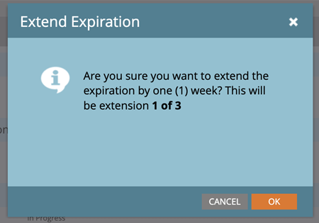

# Migreren naar Adobe-identiteit {#migrating-to-adobe-identity}

Wanneer Adobe de gebruikersmigratie van een abonnement plant, krijgen Marketo Engage-productbeheerders toegang tot de migratieconsole, die u vindt in het navigatiemenu in het beheergebied onder Integratie.

## Pre-migratie {#pre-migration}

Voordat de migratie begint, kan een beheerder de begindatum voor de gebruikersmigratie voor zijn abonnement wijzigen door naar het scherm Pre-Migration in de migratieconsole te navigeren. Om de datum te veranderen, kan de beheerder **klikken geeft** knoop uit.

De beheerder kan een datum kiezen tussen 8 en 30 dagen in de toekomst. Wanneer een datum wordt geselecteerd, moet de beheerder **sparen** klikken om de verandering aan te brengen.

>[!NOTE]
>
>Als u een datum wilt aanvragen die valt vóór 8 dagen of na 30 dagen, of als u de datum na de vergrendeling van de pre-migratieconsole moet aanpassen, stuurt u een e-mail naar `marketocares@marketo.com` .

## Migratie naar Adobe Identity {#migrations-to-adobe-identity}

Alle Marketo-abonnementen met een Amerikaanse tijdzone worden gemigreerd vanaf middernacht, Pacific Standard Time, de begindatum van de gebruikersmigratie. De migratie van de gebruiker voor alle andere abonnementen zal om middernacht van de gespecificeerde tijdzone van het abonnement beginnen. Wanneer de gebruikersmigratie van een abonnement begint, is gebruikersbeheer niet meer beschikbaar in het gebied Marketo Admin en wordt het alleen in de Adobe Admin Console uitgevoerd. Rolbeheer blijft aanwezig op het tabblad Gebruikers en rollen in het gebied Marketo Admin en op het lokale gebruikersbeheer (alleen API).

Adobe migreert automatisch alle Marketo Admins (met een standaard beheerdersrol) met geverifieerde e-mails eerst. Als Marketo Admins naar Adobe Identity wordt gemigreerd, worden ze als productbeheerder voor het Marketo-abonnement toegevoegd aan de Adobe Admin Console van het abonnement en krijgen ze de rol Adobe Product Admin toegewezen in de Marketo-toepassing (samen met andere rollen die ze eerder hadden) en hebben hun Adobe ID recht op het abonnement. De beheerders ontvangen twee e-mails. Een daarvan geeft aan dat hij als Admin Console-productbeheerder is toegewezen en de andere geeft aan dat zijn Adobe ID recht heeft op het Marketo-product.

>[!IMPORTANT]
>
>U moet de **Accepteer Uitnodiging** knoop in machtigingsE-mail klikken om tot Marketo Engage met uw Adobe ID toegang te hebben.

**E-mail van de Beheerder van het Product van Marketo**

**E-mail van de Entitlement van Marketo**

**als uw Marketo abonnement geen SSO in Marketo en/of uw Adobe Org** heeft, zal Adobe automatisch de rest van uw gebruikers migreren. Deze workflow is bedoeld om het hoogste niveau van automatisering te bieden en er is geen actie vereist om de migratie uit te voeren. Na het voltooien van de migratie wordt de Marketo Migration Console niet meer weergegeven in het Marketo Admin-navigatiegebied en kunnen alle gebruikers Marketo openen via een Adobe ID.

**als uw Marketo abonnement SSO in Marketo en/of uw Adobe Org** heeft, zullen de Admins van Marketo toegang tot het hulpmiddel van de Migratie van de Gebruiker van de Zelfbediening van de Console van de Migratie krijgen wanneer het beginnen van de gebruikersmigratie en via banner op login op de Mijn pagina van Marketo worden gealarmeerd. De beheerder is verantwoordelijk voor het voltooien van de gebruikersmigratie met het Self-Service User Migration-hulpprogramma.

## Marketo Self-Service-gebruikersmigratie {#marketo-self-service-user-migration}

Het Marketo Self-Service User Migration Console-hulpprogramma bestaat uit twee tabbladen.

* **het lusje van de Status van de Migratie**
* **het lusje van de Migratie van de Gebruiker**

Er zijn drie hoofdstappen vereist om een migratie naar zelfbediening te voltooien.

1. Alle gewenste gebruikers met een e-mailadres dat is geverifieerd met uw e-mailadres migreren (tabblad Gebruikersmigratie)
1. Alle niet-in aanmerking komende gebruikers en alle ongewenste in aanmerking komende gebruikers overslaan (tabblad Gebruikersmigratie)
1. Nadat stap 1 en 2 zijn uitgevoerd, voltooit u de migratiebevestiging (tabblad Migratiestatus)

### Tabblad Migratiestatus {#migration-status-tab}

Het tabblad Migratiestatus bevat algemene maatstaven voor de voortgang van de e-mailverificatie van gebruikers, de migratie en activering van gebruikers en de voltooiing van de abonnementmigratie.

Boven aan de Migratiestatus worden het verlopen van de abonnementmigratie en de knop voor het verlengen van de vervaldatum weergegeven. Meer informatie over migratieafloop kan in de [ sectie van de Vervalsing van de Migratie van de Gebruiker worden gevonden ](#user-migration-expiration).

In het volgende gedeelte van het tabblad Migratiestatus zijn er twee voortgangsbalken. In de eerste voortgangsbalk ziet u de voortgang van het voltooien van de e-mailverificatie van de gebruiker. In de tweede voortgangsbalk ziet u de voortgang van de voltooiing van de gebruikersmigratie.

Daarna, zijn er drie secties van de Status die aan admin worden getoond.

* **E-mailverificatie van de Gebruiker**: verificatiestatus van gebruikers binnen het abonnement.
* **Migratie en Activering van de Gebruiker**: de migratie en de activering van de gebruiker (migratie en recht op het product van Marketo Engage) status van de gebruikers binnen het abonnement.
* **Bevestiging van de Migratie**: de status van de migratievoltooiing van het abonnement.

#### E-mailverificatie van gebruiker {#user-email-verification}

In het gedeelte E-mailverificatie van gebruiker kan een beheerder de huidige status van e-mailverificatie voor de gebruikers in het abonnement vinden, voordat er wordt overgeschakeld naar Adobe Identity.

Een beheerder kan de verificatiestatus van het abonnement, het percentage gebruikers in het abonnement dat de e-mailverificatie heeft voltooid, en het aantal gebruikers die zijn gemarkeerd als overgeslagen, weergeven. De status wordt gerapporteerd over de status van de e-mailverificatiestatus van alle gebruikers in het abonnement. De beheerder kan op het aantal overgeslagen gebruikers klikken en zal aan het lusje van de Migratie van de Gebruiker worden genavigeerd om de overgeslagen gebruikers te bekijken.

De verificatie-e-mail kan opnieuw worden verzonden door een beheerder op het tabblad Gebruikersmigratie van de migratieconsole en het tabblad Gebruiker en rollen in het gebied Marketo Admin of door de gebruiker in de accountinstellingen. De koppeling in het verificatiebericht verloopt over 3 dagen, net als in e-mails met gebruikersuitnodigingen. Meer informatie over e-mailverificatie kan op de [ Gemeenschap ](https://nation.marketo.com/) en in de [ documentatie van de e-mailverificatie ](/help/marketo/product-docs/administration/users-and-roles/email-verification.md) worden gevonden.

>[!IMPORTANT]
>
>Als een Marketo Engage-gebruiker zijn e-mailadres niet verifieert, kan hij of zij niet naar een Adobe ID worden gemigreerd en verliest hij of zij de toegang tot het Marketo-abonnement nadat de migratie is voltooid. Om toegang te krijgen, moet een Marketo-productbeheerder deze als nieuwe gebruiker toevoegen.

#### Migratie en activering van gebruikers {#user-migration-and-activation}

In de sectie Gebruikersmigratie en -activering kan een beheerder de huidige status van de totale gebruikersmigratie en de machtiging voor het Adobe Identity Management-systeem vinden.

Een beheerder kan het percentage gebruikers in hun abonnement bekijken dat naar een Adobe ID is gemigreerd of als Overgeslagen is gemarkeerd. De status wordt gerapporteerd over de status van de migratiestatus van alle gebruikers naar een Adobe ID in het abonnement, of wordt gemarkeerd als Overgeslagen en wordt niet gemigreerd. Wanneer gebruikers worden gemigreerd en recht hebben op Marketo Engage of worden overgeslagen, wordt deze status bijgewerkt.

#### Migratiebevestiging {#migration-confirmation}

In het gedeelte Migratiebevestiging moet een beheerder bevestigen dat de migratie van gebruikers is voltooid voor het abonnement.

Wanneer alle gebruikers in het abonnement zijn aangemeld (gemigreerd of overgeslagen), wordt de knop &#39;Volledige migratie&#39; weergegeven.

De beheerder die migratie leidt zal de migratiebevestiging moeten voltooien door de **Volledige knoop van de Migratie** te klikken. Zij zullen ertoe aangezet worden **bevestigen**.

Nadat de voltooiing van de gebruikersmigratie is bevestigd, wordt de migratieconsole verwijderd uit het navigatiemenu Admin.

### Verlopen gebruikersmigratie {#user-migration-expiration}

Adobe vereist dat klanten binnen 30 dagen de migratie voor eigen gebruik voltooien. Beheerders worden niet geblokkeerd voor het migreren van gebruikers of het voltooien van de migratie als de vervaldatum verstreken is. Ze kunnen echter alleen op verzoek gebruikers migreren. Als een beheerder meer tijd nodig heeft, kan hij of zij de vervaldatum van het abonnement verlengen.

Op het klikken van de **breidt de Expiratie** knoop uit, zal de datum aan één week later worden bijgewerkt. Een beheerder kan de looptijd tot drie keer verlengen.

Adobe zal uitreiken als u de migratie niet voltooit tegen de vervaldatum.

### Tabblad Gebruikersmigratie {#user-migration-tab}

Op het tabblad Gebruikersmigratie kunnen beheerders de volledige controle over de migratie van gebruikers hebben.

Beheerders kunnen kiezen uit:

* E-mails met verificatie voor niet-geverifieerde gebruikers activeren via de knop E-mail verifiëren
* Overslaan van gebruikersmigratie voor gebruikers die weten of de beheerder hun e-mail kan/zal verifiëren of niet mag worden gemigreerd via de knop Migratie overslaan
* Geselecteerde gebruikers op aanvraag migreren via de knop Nu migreren
* De gebruikersmigratie voor een bepaalde datum plannen via de knop &#39;Migratie plannen&#39;
* Alle in aanmerking komende gebruikers naar behoefte migreren (geen gebruikersselectie nodig) via de knop Alle gebruikers migreren

**verifieer E-mail**

E-mailverificatie is vereist voor het migreren van een gebruiker naar een Adobe ID. Als er gebruikers zijn die hun e-mailadres niet hebben geverifieerd en die moeten worden gemigreerd, kan de beheerder de verificatie-e-mail activeren om opnieuw naar de gebruiker te worden verzonden. Als u een niet-geverifieerde gebruiker selecteert, wordt op de knop E-mail controleren geklikt.

Wanneer de beheerder **klikt verifieer E-mail** knoop, zullen zij een bericht ontvangen e-mail werd verzonden.

**overslaan en de Migratie van de Gebruiker Unskip**

Tijdens gebruikersmigratie moeten alle gebruikers worden gemigreerd of overgeslagen. Adobe vereist dat beheerders erkennen dat een gebruiker niet wordt gemigreerd en dat een beheerder de gebruiker moet markeren als overgeslagen. Als de beheerder dit niet doet, kunnen ze de voltooiing van de gebruikersmigratie niet bevestigen. Alle overgeslagen gebruikers verliezen de toegang tot Marketo zodra de gebruikersmigratie is voltooid.

>[!IMPORTANT]
>
>Een beheerder moet alle gebruikers met niet-geverifieerde e-mails overslaan. Als er gebruikers zijn die hun e-mails hebben geverifieerd, maar de beheerder ze om welke reden dan ook niet wil migreren, moeten ze ze als overgeslagen markeren.

Als u een gebruiker wilt overslaan, kan de beheerder de gewenste gebruiker(s) selecteren. Klik op de knop &#39;Migratie overslaan&#39;. Op het klikken van de **knoop van de Migratie van de Overslaan**, zal de pagina zich verfrissen en zal de geselecteerde de verificatiestatus en migratiestatus van de gebruiker aan &quot;Overgeslagen&quot;worden bijgewerkt.

Een beheerder kan een eerder overgeslagen gebruiker ongedaan maken, als het wordt bepaald dat de gebruiker moet worden gemigreerd.

Als u het overslaan van een gebruiker ongedaan wilt maken, kan de beheerder de gewenste gebruiker selecteren. Klik op de knop &#39;Migratie ongedaan maken&#39;. Op het klikken van de **Unskip Migratie** knoop, zal de pagina zich verfrissen.  De verificatiestatus van de geselecteerde gebruiker wordt bijgewerkt naar de huidige status &#39;Verified&#39; of &#39;Unverify&#39; en de migratiestatus van de gebruiker wordt bijgewerkt naar &#39;Not Started&#39;.

>[!NOTE]
>
>De knop &#39;Migratie ongedaan maken&#39; is alleen actief als alle geselecteerde gebruikers de status &#39;Overgeslagen&#39; hebben bij Migratie.

### Marketo-gebruikers migreren naar Adobe-id&#39;s {#migrating-marketo-users-to-adobe-ids}

Marketo-productbeheerders kunnen gebruikers selecteren voor migratie in batches of voor alle in aanmerking komende gebruikers tegelijk. Als gebruikers zijn geselecteerd, hebben beheerders de optie &quot;Nu migreren&quot; of &quot;Migratie plannen&quot; voor een latere datum, zodat beheerders flexibel zijn en zelf kunnen bepalen welke gebruikers worden gemigreerd en wanneer. Beheerders krijgen ook de optie &quot;Alle gebruikers migreren&quot; in een abonnement te zien.

Een beheerder kan bijvoorbeeld een groep &#39;machtsgebruikers&#39; selecteren die ze eerst willen migreren. Wanneer deze gebruikersmigraties zijn voltooid, kunnen ze verschillende groepen gebruikers selecteren op basis van variabelen zoals werkruimte/bedrijf of functie/rol om de migratie van gebruikers verder te beperken tot batchgebruikers. Of ze kunnen besluiten om de rest van de gebruikers in de abonnementen te migreren nadat de eerste batch is geslaagd. Het doel is om gebruikers de meeste flexibiliteit te bieden bij het implementeren van Adobe-id&#39;s.

Alle gebruikersmigraties vinden gelijktijdig plaats en moeten binnen zestig seconden met succes worden voltooid. Terwijl de gebruikersmigratie voor een specifieke gebruiker plaatsvindt, zou de gebruiker toegang tot maximaal 1 minuut kunnen verliezen, en dat is slechts als de gebruiker in de toepassing wordt geregistreerd. Na voltooiing van de gebruikersmigratie ontvangt de gebruiker een e-mail over hoe hij zich bij Marketo Engage kan aanmelden met een Adobe-identiteit. De gebruiker moet de uitnodiging via de knoopverbinding in e-mail _goedkeuren alvorens_ zij binnen met een Adobe ID kunnen ondertekenen. De instructies op hoe te om in Marketo Engage met Adobe ID [ te ondertekenen kunnen hier ](/help/marketo/product-docs/administration/marketo-with-adobe-identity/user-sign-in-with-adobe-id.md) worden gevonden.

Migraties van gebruikers worden onafhankelijk verwerkt. Als de migratie van gebruikers mislukt, zal Adobe andere migraties van gebruikers blijven verwerken. Als er een fout optreedt bij de gebruikersmigratie, is er geen actie vereist door een beheerder. De beheerder zal een e-mailbericht over de fout worden verzonden en gealarmeerd dat Adobe bezig is het probleem onmiddellijk op te lossen. Als de migratie van een gebruiker mislukt en deze gebruiker is aangemeld bij Marketo Engage, kan de gebruiker de toegang tot de computer tot maximaal twee minuten verliezen terwijl er zich migratiepogingen voordoen. Als de migratie van een gebruiker mislukt, kan de gebruiker Marketo Engage blijven benaderen met zijn Marketo-identiteit totdat hij of zij een e-mail ontvangt met de melding dat de migratie is gelukt en dat hij of zij is uitgenodigd om zich aan te melden bij een Adobe ID.

**Migreer nu**

Een beheerder kan een of meer gebruikers selecteren om op verzoek te migreren. Dit zal de migratie van de gebruikers onmiddellijk teweegbrengen. Als u een of meer gebruikers wilt migreren, kan de beheerder de gewenste gebruiker(s) selecteren en wordt op de knop &#39;Nu migreren&#39; geklikt.

>[!NOTE]
>
>De knop &#39;Nu migreren&#39; is alleen actief als alle geselecteerde gebruikers de verificatiestatus &#39;Verified&#39; hebben.

Na het klikken van de **Migreer nu** knoop, zal de beheerder worden ertoe aangezet om migratie van de geselecteerde gebruiker(s) te bevestigen. Zodra de beheerder bevestigt, zullen de gebruikersmigraties beginnen verwerking zo spoedig mogelijk.

**Migratie van het Programma**

Een beheerder kan een of meer gebruikers selecteren om de migratie op een latere datum te plannen. Om migratie voor één of meerdere gebruikers te plannen, selecteert de beheerder de gewenste gebruiker(s) en de knoop van de Migratie van het Programma zal klikbaar worden.

>[!NOTE]
>
>De knop Geplande migratie is alleen actief als alle gebruikers de verificatiestatus &quot;Verified&quot; en de migratiestatus &quot;Not Started&quot; of &quot;Adobe ID Created&quot; hebben.

Op het klikken van de **knoop van de Migratie van het Programma**, zal de beheerder worden ertoe aangezet om de gewenste migratiedatum van de geselecteerde gebruiker(s) te selecteren. De beheerder kan alleen datums selecteren vóór de migratiedatum van het abonnement. Wanneer de beheerder bevestigt, zal (zullen) de gebruikersmigratie(s) gepland zijn om met verwerking op de geselecteerde datum te beginnen.

>[!NOTE]
>
>Alle Marketo-abonnementen met een Amerikaanse tijdzone worden gemigreerd vanaf middernacht, Pacific Standard Time, van de startdatum van de migratie. De migratie van de gebruiker voor alle andere abonnementen zal om middernacht van de gespecificeerde tijdzone van het abonnement beginnen.

**Migreer Alle Gebruikers**

Een beheerder kan alle in aanmerking komende gebruikers in een abonnement op elk gewenst moment migreren. Dit zal de migratie van de in aanmerking komende gebruikers onmiddellijk in gang zetten. In aanmerking komende gebruikers zijn gebruikers met geverifieerde e-mails die nog niet zijn gemigreerd.

Op het klikken van de **Migreer Alle Gebruikers** knoop, zal de beheerder worden ertoe aangezet **** migratie van alle in aanmerking komende gebruikers bevestigen. Wanneer de beheerder dit bevestigt, worden de gebruikersmigraties zo snel mogelijk verwerkt.

