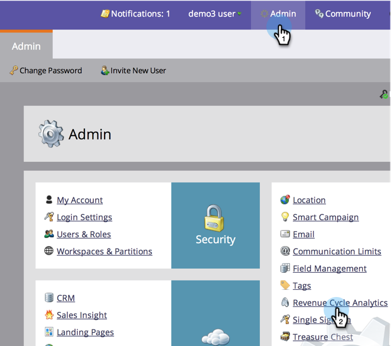

# Kenmerkinstellingen wijzigen voor Analytics {#change-attribution-settings-for-analytics}

U kunt de manier veranderen waarop Marketo contacten verbindt met kansen voor eerste en multi-aanraking attributie, lood omzettingsmetriek, en de marketing-beïnvloede opportuniteitsvlag.

Deze montages zullen de rapporten van de Ontdekkingsreiziger van de Opbrengst onder de montages beïnvloeden [Analyse van programmamogelijkheden](/help/marketo/product-docs/reporting/revenue-cycle-analytics/program-analytics/understanding-the-program-opportunity-analysis-area.md), [Opportuniteitsanalyse](/help/marketo/product-docs/reporting/revenue-cycle-analytics/revenue-explorer/understanding-opportunity-analysis-in-revenue-explorer.md), en gebieden van de Analyse van het Lood. Dit zal ook het rapport van de Analysator van het Programma beïnvloeden.

1. Onder de **Beheer** sectie, klikt u op **Analyse van inkomstencyclus**.

   

1. Klik op de knop **Bewerken** link onder **Attributie**.

   

   >[!TIP]
   >
   >Als u deze instelling wijzigt, worden Marketo-gegevens niet gewijzigd. het verandert eenvoudig de manier waarop uw rapporten lopen. Dit kan op elk ogenblik worden omgekeerd.

1. Selecteer een optie en klik op **Opslaan**.

   

   >[!NOTE]
   >
   >**Definitie**
   >
   >**Expliciet**: Alleen contacten met rollen (standaard).
   >
   >**Hybride**: Contactpersonen met rollen, indien beschikbaar. Als niets beschikbaar is, gebruikt het alle contacten in rekeningen.
   >
   >**Impliciet**: Alle contacten ongeacht rol.

>[!CAUTION]
>
>Wanneer u **Impliciet**, zal Marketo altijd alle contacten onderzoeken verbonden aan de rekening ongeacht rol. **Marketo raadt sterk aan de expliciete modus te gebruiken**. Het gebruik van Impliciet kan tot valse positieven leiden; dat wil zeggen, mensen die een kans verdienen ondanks het feit dat ze geen echte invloed op de kansen hebben. Wees voorzichtig met Impliciet gebruiken.
