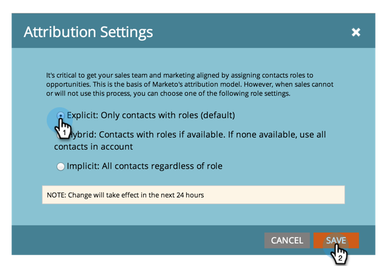

# Kenmerkinstellingen wijzigen voor Analytics {#change-attribution-settings-for-analytics}

U kunt de manier veranderen waarop Marketo contacten verbindt met kansen voor eerste en multi-aanraking attributie, lood omzettingsmetriek, en de marketing-beïnvloede opportuniteitsvlag.

Deze montages zullen [!UICONTROL Revenue Explorer] rapporten onder de [ Analyse van de Kans van het Programma ](/help/marketo/product-docs/reporting/revenue-cycle-analytics/program-analytics/understanding-the-program-opportunity-analysis-area.md), [ Analyse van de Kans ](/help/marketo/product-docs/reporting/revenue-cycle-analytics/revenue-explorer/understanding-opportunity-analysis-in-revenue-explorer.md), en de gebieden van de Analyse van de Lood beïnvloeden. Dit heeft ook invloed op het [!UICONTROL Program Analyzer] -rapport.

1. Ga naar het **[!UICONTROL Admin]** -gebied.

   

1. Klik op **[!UICONTROL Revenue Cycle Analytics]**.

   

1. Klik op de koppeling **[!UICONTROL Edit]** onder **[!UICONTROL Attribution]** .

   

   >[!TIP]
   >
   >Als u deze instelling wijzigt, worden er geen Marketo-gegevens gewijzigd. De manier waarop rapporten worden uitgevoerd, verandert. Dit kan op elk ogenblik worden omgekeerd.

1. Selecteer een optie en klik op **[!UICONTROL Save]** .

   

   >[!NOTE]
   >
   >**Definitie**
   >
   >**[!UICONTROL Explicit]**: Alleen contacten met rollen (standaardwaarde).
   >
   >**[!UICONTROL Hybrid]**: contactpersonen met rollen, indien beschikbaar. Als niets beschikbaar is, gebruikt het alle contacten in rekeningen.
   >
   >**[!UICONTROL Implicit]**: Alle contactpersonen, ongeacht de rol.

>[!CAUTION]
>
>Als u **[!UICONTROL Implicit]** gebruikt, controleert Marketo altijd alle contactpersonen die aan het account zijn gekoppeld, ongeacht de rol. **Marketo adviseert sterk het gebruiken van [!UICONTROL Explicit] wijze**. Het gebruik van [!UICONTROL Implicit] kan leiden tot valse positieven, d.w.z. tot mensen met krediet voor een kans, hoewel ze geen echte invloed in de kans hebben. Wees voorzichtig met het gebruik van [!UICONTROL Implicit] .
