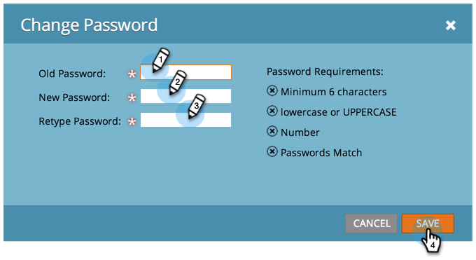

# Je Marketo-wachtwoord wijzigen {#change-your-marketo-password}

Wijzig uw Marketo-wachtwoord met deze eenvoudige stappen.

1. Ga naar de **[!UICONTROL Admin]** gebied.

   

1. Klik op **[!UICONTROL My Account]**.

   

1. Klik op **[!UICONTROL Change Password]**.

   

1. Voer het oude wachtwoord en het nieuwe wachtwoord in en klik vervolgens op **[!UICONTROL Save]**.

   

   >[!NOTE]
   >
   >Neem nota van de wachtwoordvereisten wanneer u de update maakt.
