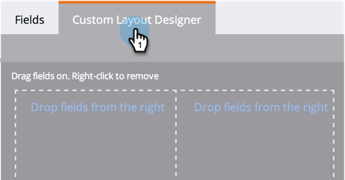

# Een aangepast tabblad maken voor de pagina Personen {#creating-a-custom-tab-for-the-person-detail-page}

Als u steeds weer op zoek bent naar een specifieke set velden in de details van de persoon, kunt u een aangepaste indeling maken om de zaken eenvoudiger te maken.

1. Ga naar **Admin** en klik **Veld Management**.

   

1. Klik op het tabblad **Aangepaste layout Designer**.

   

1. Zoek een veld dat u wilt toevoegen, sleep het en zet het neer op het canvas.

   

1. Voeg velden toe totdat u de gewenste indeling hebt.

   

   >[!NOTE]
   >
   >U hebt twee kolommen om mee te werken.

   Als u besluit dat u een veld wilt verwijderen, klikt u met de rechtermuisknop op het veld dat u wilt verwijderen en klikt u op **Verwijderen**.

   

   Geweldig werk! Wanneer u nu de gegevens van een persoon laadt, kunt u de aangepaste layout gebruiken om toegang te krijgen tot de informatie die voor u van belang is.

   
