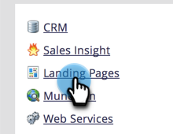

# De URL&#39;s van uw bestemmingspagina aanpassen met een CNAME  {#customize-your-landing-page-urls-with-a-cname}

Hoewel Marketo uw landingspagina&#39;s host, moet de URL voor uw bedrijf worden aangepast.

>[!NOTE]
>
>Geen CNAME:
>
>https://na-sj02.marketo.com/lp/mktodemoaccount126/UnsubscribePage.html
>
>merknaam:
>
>https://go.**YourCompany**.com/UnsuscribePage.html

>[!NOTE]
>
>**Beheerdersmachtigingen vereist**

Laten we je oprichten!

1. Kies een NAAM.

   Het is het eerste deel van de URL. Voorbeelden:

   * **gaan**.YourCompany.com/NameOfPage.html
   * **info**.YourCompany.com/NameOfPage.html
   * **pagina&#39;s**.YourCompany.com/NameOfPage.html

   Het ene woord (plus YourCompany.com) wordt een CNAME genoemd. U hebt dit later nodig, dus noteer het.

1. Zoek de tekenreeks van uw account.

1. Ga naar de **[!UICONTROL Admin]** gebied.

   

1. Klik op **[!UICONTROL Landing Pages]**.

   

1. Onder de **[!UICONTROL Landing Pages]** , kopieert u de tekenreeks Account vanuit het gedeelte Instellingen.

   

1. U hebt dit later ook nodig, dus noteer het.

1. Verzoek naar IT verzenden.

1. Vraag uw personeel van IT om volgende CNAME (vervang het woord [CNAME] en [ACCOUNTTEKENREEKS] met de tekst van de vorige stap):

   [CNAME].YourCompany.com > [ACCOUNTTEKENREEKS].mktoweb.com

1. Volledige CNAME-instelling.

1. Ga terug naar de **[!UICONTROL Admin]** gebied.

   

1. Klik op **[!UICONTROL Landing Pages]**.

   

1. Onder de **[!UICONTROL Settings]** sectie, klikt u op **[!UICONTROL Edit]**.

   

1. Voer uw CNAME in **[!UICONTROL Domain name for Landing Pages]**, voer uw **[!UICONTROL Fallback page]**, voer uw **[!UICONTROL Homepage]** en klik op **[!UICONTROL Save]**.

   

Je fallback-pagina is waar mensen worden omgeleid als je Marketo-landingspagina niet beschikbaar is.

Mooi werk! De landingspagina&#39;s zijn nu gecodeerd met uw bedrijfsdomein.
