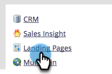

# Instellingen openingspagina bewerken {#edit-landing-page-settings}

U kunt de domeinnaam en de fallback-pagina bewerken, het vooraf invullen van het formulier in- of uitschakelen, misbruik van de bestemmingspagina voorkomen en nog veel meer. Zo gaat het.

>[!NOTE]
>
>**Vereiste Bevoegdheden Admin**

1. Ga naar het **[!UICONTROL Admin]** -gebied.

   

1. Klik op **[!UICONTROL Landing Pages]**.

   

1. Klik in de sectie **[!UICONTROL Landing Pages]** op **[!UICONTROL Edit]** .

   

1. Voer uw domein- en paginagegevens in.

   

   | Term | Definitie |
   |---|---|
   | [!UICONTROL Domain name for landing pages] | Dit is uw NAAM. Een CNAME is het eerste deel van URL u mensen voor het landen van pagina&#39;s geeft. In `https://go.yourCompany.com` is het woord &quot;go&quot; bijvoorbeeld de CNAME. Je kan meerdere, maar de meeste mensen gebruiken gewoon het ene. |
   | [!UICONTROL Fallback page] | Dit is waar je naartoe moet als de landingspagina niet bestaat of omlaag is. Leer meer over [&#x200B; reservepagina&#39;s &#x200B;](/help/marketo/product-docs/administration/settings/set-a-fallback-page.md). |
   | [!UICONTROL Homepage] | Voer de URL van uw bedrijfssite in. |

1. Schakel het selectievakje **[!UICONTROL Form Prefill]** in om formulieren de mogelijkheid te bieden om informatie voor bekende (gekoelde) personen vooraf in te vullen. Schakel de optie uit om te blokkeren.

   

   >[!NOTE]
   >
   >Als u de tag prefill `<script>` wilt weergeven aan het einde van de tag `<head>` in de code, schakelt u het selectievakje **[!UICONTROL Inject Prefill Script at End of Head]** in. Laat deze optie uitgeschakeld als u deze aan het begin wilt weergeven.
   >
   >Schakel **[!UICONTROL Remove default favicon links]** in om te voorkomen dat Marketo favicon-koppelingen invoegt in de code.

1. Nadat u de selecties hebt gemaakt, klikt u op **[!UICONTROL Save]** .

   

   Geweldig werk! De bestemmingspagina&#39;s hebben nu de juiste informatie en moeten meteen aan het werk gaan.
