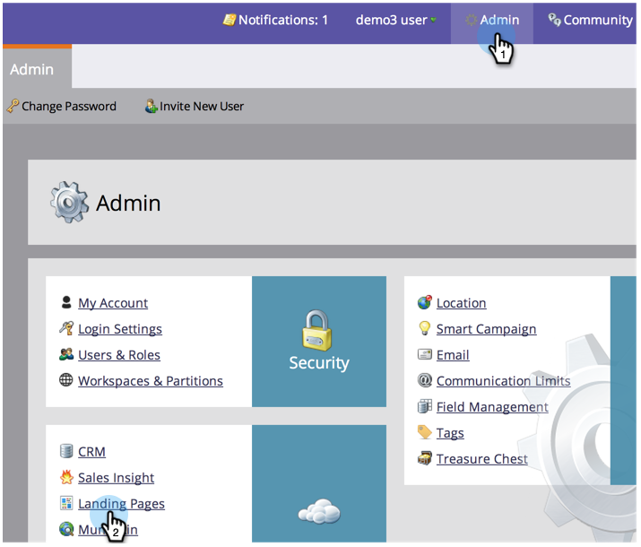

# Instellingen openingspagina bewerken {#edit-landing-page-settings}

U kunt de domeinnaam en de fallback-pagina bewerken, het vooraf invullen van het formulier in- of uitschakelen, misbruik van de bestemmingspagina voorkomen en nog veel meer. Zo gaat het.

>[!NOTE]
>
>**Beheerdersmachtigingen vereist**

1. Klik onder **Beheer** op **Pagina&#39;s** landen.

   

1. Klik in de sectie **Landing Pages** op **Edit**.

   

1. Voer uw domein- en paginagegevens in.

   | Term | Definitie |
   |---|---|
   | Domeinnaam voor bestemmingspagina&#39;s | Dit is uw NAAM. Een CNAME is het eerste deel van URL u mensen voor het landen van pagina&#39;s geeft. In `http://go.yourCompany.com`dit voorbeeld is het woord &quot;go&quot; de CNAME. Je kan meerdere, maar de meeste mensen gebruiken gewoon het ene. |
   | Pagina voor alternatieven | Dit is waar je naartoe moet als de landingspagina niet bestaat of omlaag is. Meer weten over [fallback-pagina](set-a-fallback-page.md)&#39;s? |
   | Homepage | Voer de URL van uw bedrijfssite in. |

   

1. Schakel het selectievakje **Formulier vooraf invullen** in om formulieren toe te staan om informatie voor bekende (gekoelde) personen vooraf in te vullen. Schakel de optie uit om te blokkeren.

   

1. Als u wilt voorkomen dat een kwaadaardige site uw inhoud lijkt te hosten, schakelt u het selectievakje **Marketo-pagina&#39;s niet insluiten in externe webpagina** &#39;s in.

   

   >[!NOTE]
   >
   >Als u wilt dat de prefill- `<script>` tag aan het einde van de `<head>` tag in de code wordt weergegeven, schakelt u het vakje **Prefill-script inspringen aan einde van kop** in. Laat deze optie uitgeschakeld als u deze aan het begin wilt weergeven.
   >
   >Schakel Standaardfavicon-koppelingen **** verwijderen in om te voorkomen dat Marketo-koppelingen in de code invoegt.

1. Nadat u de gewenste opties hebt geselecteerd, klikt u op **Opslaan.**

   

   Geweldig werk! De bestemmingspagina&#39;s hebben nu de juiste informatie en moeten meteen aan het werk gaan.

