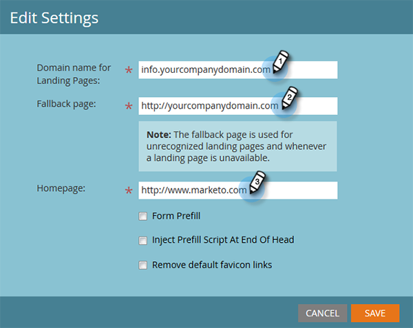

# Instellingen openingspagina bewerken {#edit-landing-page-settings}

U kunt de domeinnaam en de fallback-pagina bewerken, het vooraf invullen van het formulier in- of uitschakelen, misbruik van de bestemmingspagina voorkomen en nog veel meer. Zo gaat het.

>[!NOTE]
>
>**Beheerdersmachtigingen vereist**

1. Ga naar de **[!UICONTROL Admin]** gebied.

   

1. Klik op **[!UICONTROL Landing Pages]**.

   

1. In de **[!UICONTROL Landing Pages]** sectie, klikt u op **[!UICONTROL Edit]**.

   

1. Voer uw domein- en paginagegevens in.

   

   | Term | Definitie |
   |---|---|
   | [!UICONTROL Domain name for landing pages] | Dit is uw NAAM. Een CNAME is het eerste deel van URL u mensen voor het landen van pagina&#39;s geeft. Bijvoorbeeld in `https://go.yourCompany.com`, het woord &quot;go&quot; is de CNAME. Je kan meerdere, maar de meeste mensen gebruiken gewoon het ene. |
   | [!UICONTROL Fallback page] | Dit is waar je naartoe moet als de landingspagina niet bestaat of omlaag is. Meer informatie over [terugvalpagina&#39;s](/help/marketo/product-docs/administration/settings/set-a-fallback-page.md). |
   | [!UICONTROL Homepage] | Voer de URL van uw bedrijfssite in. |

1. Controleer de **[!UICONTROL Form Prefill]** Schakel het selectievakje in om formulieren de mogelijkheid te bieden om vooraf gegevens in te vullen voor bekende (gekoelde) personen. Schakel de optie uit om te blokkeren.

   

1. Als u wilt voorkomen dat een kwaadaardige site uw inhoud lijkt te hosten, controleert u de **[!UICONTROL Do not allow Marketo pages to be embedded in external web pages]** selectievakje.

   

   >[!NOTE]
   >
   >Als u de voorvoegsel wilt `<script>` -tag wordt weergegeven aan het einde van de `<head>` tag in de code, controleer de **[!UICONTROL Inject Prefill Script at End of Head]** doos. Laat deze optie uitgeschakeld als u deze aan het begin wilt weergeven.
   >
   >Controleren **[!UICONTROL Remove default favicon links]** om te voorkomen dat Marketo een favicon-koppeling invoegt in de code.

1. Nadat u de selecties hebt gemaakt, klikt u op **[!UICONTROL Save]**.

   

   Geweldig werk! De bestemmingspagina&#39;s hebben nu de juiste informatie en moeten meteen aan het werk gaan.
