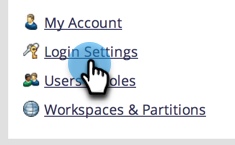

# Vervaldatum koppeling bewerken in rapporten en waarschuwingen {#edit-link-expiration-in-reports-and-alerts}

Koppelingen in je e-mailberichten met je abonnement op rapporten verlopen na drie dagen. Voer de volgende stappen uit om de vervaltijd voor deze koppelingen te wijzigen.

>[!NOTE]
>
>**Vereiste Bevoegdheden Admin**

1. Ga naar de sectie **[!UICONTROL Admin]** .

   

1. Klik op **[!UICONTROL Login Settings]**.

   

1. Klik op **[!UICONTROL Edit URL Expiration]**.

   

1. Selecteer in de vervolgkeuzelijst het aantal dagen voordat de koppeling vervalt. Klik op **[!UICONTROL Save]**.

   

>[!IMPORTANT]
>
>Deze instelling geldt alleen voor koppelingen in rapporten en waarschuwingen. Het is **niet** van toepassing op de gemailde [&#x200B; verbinding van het downloadrapport &#x200B;](/help/marketo/product-docs/reporting/basic-reporting/report-subscriptions/subscribe-to-a-smart-list.md#email-message) of marketing e-mails.
