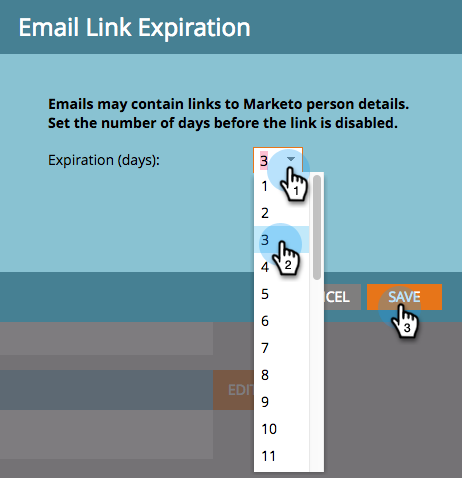

# Vervaldatum koppeling bewerken in rapporten en waarschuwingen {#edit-link-expiration-in-reports-and-alerts}

Koppelingen in je e-mailberichten met je abonnement op rapporten verlopen na drie dagen. Voer de volgende stappen uit om de vervaltijd voor deze koppelingen te wijzigen.

>[!NOTE]
>
>**Beheerdersmachtigingen vereist**

1. Ga naar de **Beheer** sectie.

   

1. Klikken **Aanmeldingsinstellingen**.

   

1. Klikken **URL-vervaldatum bewerken**.

   

1. Selecteer in de vervolgkeuzelijst het aantal dagen voordat de koppeling vervalt. Klikken **Opslaan**.

   

>[!IMPORTANT]
>
>Deze instelling geldt alleen voor koppelingen in rapporten en waarschuwingen. Het doet het **niet** van toepassing zijn op de e-mail [downloadrapport](/help/marketo/product-docs/reporting/basic-reporting/report-subscriptions/subscribe-to-a-smart-list.md#email-message) e-mails met links of marketingberichten.
