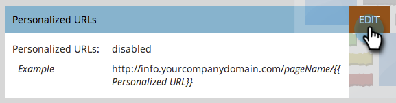

# Persoonlijke URL&#39;s voor uw account inschakelen {#enable-personalized-urls-for-your-account}

Persoonlijke URL&#39;s zijn ideaal voor campagnes voor gedrukte post.

>[!NOTE]
>
>**Vereiste Bevoegdheden Admin**

1. Ga naar het **[!UICONTROL Admin]** -gebied.

   

1. Klik op **[!UICONTROL Landing Pages]**.

   

1. Klik op **[!UICONTROL Edit]**.

   

1. Controleer het vak **[!UICONTROL Enable Personalized URLs]** en klik op **[!UICONTROL Save]** .

   

Geweldig werk! Nu u PURLs voor uw rekening hebt toegelaten, kunt u [ hen voor individuele het landen pagina&#39;s ](/help/marketo/product-docs/demand-generation/landing-pages/personalizing-landing-pages/enable-personalized-urls-for-a-landing-page.md) toelaten.

>[!NOTE]
>
>Als er twee personen met dezelfde voornaam/achternaam zijn, voegt het systeem automatisch een getal aan het einde toe.
