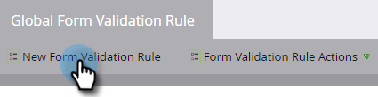

# Algemene regels voor formuliervalidatie {#global-form-validation-rules}

Met deze functie kunt u blokkeren dat bepaalde domeinen formulieren naar een Marketo Engage verzenden.

## Hoe te om Toegang toe te laten {#how-to-enable-access}

Voordat u deze functie kunt gebruiken, moet u de machtigingen per gewenste rol inschakelen.

1. Klik in Marketo op **[!UICONTROL Admin]** .

   

1. Klik op **[!UICONTROL Users & Roles]**.

   

1. Klik op de tab **[!UICONTROL Roles]** .

   

1. Dubbelklik op de rol waaraan u machtigingen wilt verlenen.

   

1. Klik op het **+** -teken naast Access Admin.

   

1. Schuif omlaag, selecteer **[!UICONTROL Access Form Validation Rules]** en klik op **[!UICONTROL Save]** .

   

## Nieuwe regel voor formuliervalidatie maken {#create-new-form-validation-rule}

>[!IMPORTANT]
>
>Deze regels zijn van toepassing op alle formulieren in uw abonnement(en) op Marketo&#39;s Engage.

1. Klik in Marketo op **[!UICONTROL Admin]** .

   

1. Klik op **[!UICONTROL Global Form Validation Rule]**.

   

1. Klik op **[!UICONTROL New Form Validation Rule]**.

   

   >[!NOTE]
   >
   >Met de vervolgkeuzelijst Handelingen formuliervalidatieregel kunt u bestaande regels verwijderen of bewerken.

1. Geef de regel een naam, geef deze een optionele beschrijving en voer het foutbericht in dat de bezoekers van het formulier moeten zien. Voer in het vak Regels de domeinen in die u wilt blokkeren, selecteer **[!UICONTROL Activate Rule]** en klik op **[!UICONTROL Create]** .

   

>[!NOTE]
>
>Marketo Engage heeft een bepaalde lijst van gewezen personen van vrije consument e-maildomeinen die worden geblokkeerd wanneer het gebruiken van onze vooraf geladen &quot;Lijst van gewezen personen van het Domein van de Consumenten E-mail&quot; regel. [ Mening die lijst hier ](/help/marketo/product-docs/administration/settings/assets/freemaildomains.csv) (om te downloaden, zorg ervoor uw browser bijgewerkt is en downloads kan goedkeuren).

## Toegang per formulier uitschakelen{#how-to-disable-access-per-form}

Zodra deze optie is ingeschakeld, zijn de regels van toepassing op alle formulieren. Als u echter een formulier met specifieke vereisten hebt en u wilt niets negeren, kunt u [!UICONTROL Global Form Validation Rules] uitschakelen in de formulierinstellingen.

1. Klik in het gewenste formulier op **[!UICONTROL Form Settings]** en vervolgens op **[!UICONTROL Settings]** .

   

1. Klik op de vervolgkeuzelijst **[!UICONTROL Global Form Validation Rules]** en kies **[!UICONTROL Disabled]** .

   

Wanneer u het formulier goedkeurt en plaatst, wordt uw [!UICONTROL Global Form Validation Rules] genegeerd.
