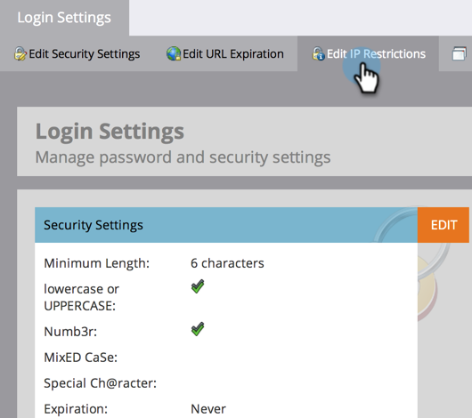

# Marketo-aanmeldingen beperken op basis van IP {#restrict-marketo-logins-based-on-ip}

U kunt gebruikers beperken of toestaan om tot Marketo toegang te hebben die op hun IP adressen wordt gebaseerd. Zo gaat het.

>[!NOTE]
>
>**Vereiste Bevoegdheden Admin**

>[!IMPORTANT]
>
>De informatie in dit artikel is bedoeld voor gebruikers die zich rechtstreeks aanmelden op login.marketo.com en is niet van toepassing op gebruikers die zich verifiëren met Adobe ID. Het is niet mogelijk om IP beperkingen op enige sign-on (SSO) logins op dit ogenblik af te dwingen.

1. Ga naar het **[!UICONTROL Admin]** -gebied.

   

1. Klik op **[!UICONTROL Login Settings]**.

   

1. Klik op **[!UICONTROL Edit IP Restrictions]**.

   

1. Kies of u **&#x200B;**&#x200B;**specifieke adressen van het Blok wilt** toestaan of, ingaan het adres(sen), dan klikken **[!UICONTROL Save]**.

   >[!NOTE]
   >
   >**Definitie**
   >
   >* **[!UICONTROL Allowed IP addresses]**: Toegestane IP-adressen toevoegen is inclusief. Het zal alle IP gespecificeerde adressen omvatten en zal alles anders uitsluiten.
   >* **[!UICONTROL Block IP addresses]**: hiermee wordt voorkomen dat specifieke IP&#39;s toegang krijgen tot Marketo.
   >* **[!UICONTROL Disable IP Restrictions]**: Als u dit inschakelt, werken er geen/alle beperkingsregels meer. Gebruik dit voor testdoeleinden.

   >[!NOTE]
   >
   >U kunt meerdere beperkingen toevoegen, maar deze kunnen ALLES zijn toegestaan of ALLES geblokkeerd. Je kunt niet mixen en overeenkomen met toegestaan en geblokkeerd.

   

   Je marketinggegevens zijn nu veiliger dan ooit!
