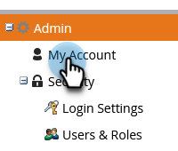

# Taal, landinstelling en tijdzone selecteren {#select-your-language-locale-and-time-zone}

Engels niet uw eerste taal? Maak je geen zorgen, we hebben je bedekt. Hieronder wordt beschreven hoe u de taal, landinstelling en tijdzone van uw Marketo Engage-abonnement kunt wijzigen.

>[!IMPORTANT]
>
>Als uw Marketo Engage abonnement aan [&#x200B; Marketo met de Identiteit van Adobe &#x200B;](/help/marketo/product-docs/administration/marketo-with-adobe-identity/adobe-identity-management-overview.md){target="_blank"} is gemigreerd, slechts [&#x200B; tijdzone &#x200B;](#change-your-time-zone) in dit artikel is op u van toepassing. Om uw taal en/of scène te veranderen, moeten die montages in uw [&#x200B; de rekeningsprofiel van Adobe &#x200B;](https://account.adobe.com/profile){target="_blank"} worden betreden.

## Ondersteunde talen {#supported-languages}

* Engels
* Frans
* Duits
* Japans
* Portugees
* Spaans

## Gebruikerstaal, landinstelling en tijdzone wijzigen {#change-user-language-locale-and-time-zone}

Ga als volgt te werk om naar het juiste gebied te gaan en kies welke instelling u wilt wijzigen.

1. Ga naar het **[!UICONTROL Admin]** -gebied.

   

1. Selecteer **[!UICONTROL My Account]**.

   

1. Klik onder Mijn account op **[!UICONTROL Edit Location Settings]** .

   

### Taal wijzigen {#change-your-language}

1. Klik op de vervolgkeuzelijst **[!UICONTROL Language]** en maak een selectie.

   

   >[!TIP]
   >
   >U kunt ook alleen de taal wijzigen door op de vervolgkeuzelijst voor de taal boven aan de aanmeldingspagina te klikken.

### Landinstelling wijzigen {#change-your-locale}

1. Klik op de vervolgkeuzelijst **[!UICONTROL Locale]** en maak een selectie.

   

### Uw tijdzone wijzigen {#change-your-time-zone}

1. Klik op de vervolgkeuzelijst **[!UICONTROL Time zone]** en maak een selectie.

   

## Opslaan {#save}

1. Nadat u de gewenste instellingen hebt gewijzigd, klikt u gewoon op **[!UICONTROL Save]** .

   

Dat is het! De browser wordt vernieuwd en de wijzigingen worden weergegeven.
