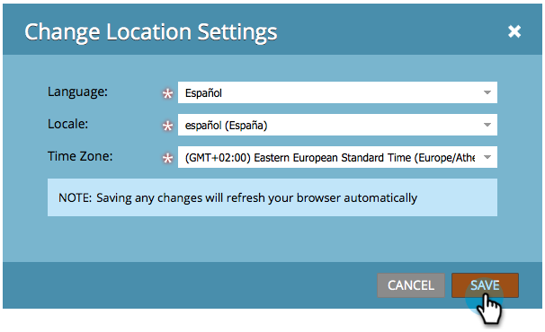

# Taal, landinstelling en tijdzone selecteren {#select-your-language-locale-and-time-zone}

Engels is niet jouw eerste taal? Maak je geen zorgen, we hebben je bedekt. Hier is hoe u uw eigen taal, landinstelling en tijdzone wijzigt.

## Ondersteunde talen {#supported-languages}

* Engels
* Frans
* Duits
* Japans
* Portugees
* Spaans

## Taal, landinstelling en tijdzone van gebruiker wijzigen {#change-user-language-locale-and-time-zone}

1. Meld u aan bij Marketo en selecteer onder uw naam **Mijn account**.

   

1. Klik onder Mijn account op **Locatie-instellingen bewerken**.

   

1. Wijzig uw **Taal**.

   

   >[!TIP]
   >
   >U kunt ook alleen de taal wijzigen door op de vervolgkeuzelijst voor de taal boven aan de aanmeldingspagina te klikken.

1. Wijzig uw **Landinstelling**.

   

1. Wijzig uw **Tijdzone**.

   

1. Klikken **Opslaan**.

   

Mooi werk! De browser wordt vernieuwd en de wijzigingen worden weergegeven.

