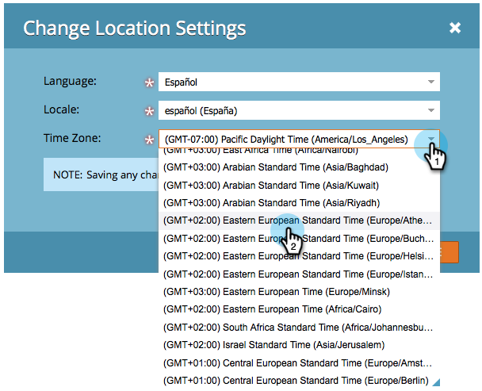

# Taal, landinstelling en tijdzone selecteren {#select-your-language-locale-and-time-zone}

Engels niet uw eerste taal? Maak je geen zorgen, we hebben je bedekt. Hieronder wordt beschreven hoe u de taal, landinstelling en tijdzone van de instantie van uw Marketo Engage wijzigt.

>[!IMPORTANT]
>
>Dit artikel is slechts voor degenen die _niet_ gebruiken [ Marketo met de Identiteit van de Adobe ](/help/marketo/product-docs/administration/marketo-with-adobe-identity/adobe-identity-management-overview.md){target="_blank"}. Als u doet, kunnen de montages hieronder worden geschetst in uw [ profiel van de de rekeningsrekening van de Adobe ](https://account.adobe.com/profile) worden betreden {target="_blank"}.

## Ondersteunde talen {#supported-languages}

* Engels
* Frans
* Duits
* Japans
* Portugees
* Spaans

## Taal, landinstelling en tijdzone van gebruiker wijzigen {#change-user-language-locale-and-time-zone}

1. Ga naar het **[!UICONTROL Admin]** -gebied.

   

1. Selecteer **[!UICONTROL My Account]** .

   

1. Klik onder Mijn account op **[!UICONTROL Edit Location Settings]** .

   

1. Wijzig de **[!UICONTROL Language]** .

   

   >[!TIP]
   >
   >U kunt ook alleen de taal wijzigen door op de vervolgkeuzelijst voor de taal boven aan de aanmeldingspagina te klikken.

1. Wijzig de **[!UICONTROL Locale]** .

   

1. Wijzig de **[!UICONTROL Time Zone]** .

   

1. Klik op **[!UICONTROL Save]**.

   

Mooi werk! De browser wordt vernieuwd en de wijzigingen worden weergegeven.

