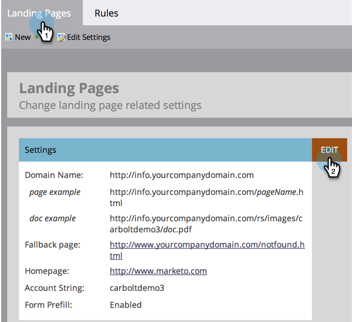

# Een terugvalpagina instellen {#set-a-fallback-page}

Terugvalpagina&#39;s zijn de laatste verdedigingsregel als de landingspagina offline is of niet wordt gevonden. Zorg ervoor dat je er een hebt.

>[!NOTE]
>
>**Vereiste Bevoegdheden Admin**

1. Ga naar het **[!UICONTROL Admin]** -gebied.

   

1. Klik op **[!UICONTROL Landing Pages]**.

   

1. Klik onder het tabblad **[!UICONTROL Landing Pages]** op **[!UICONTROL Edit]** .

   

1. Voer een **[!UICONTROL Fallback page]** in het dialoogvenster in en klik op **[!UICONTROL Save]** .

   
