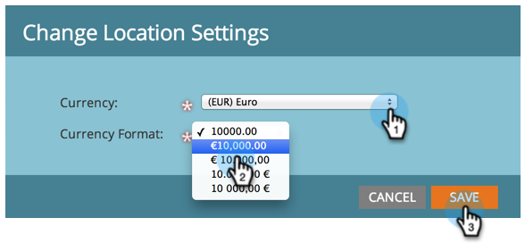

# De standaardvaluta instellen {#set-default-currency}

Leer hoe u de standaardvaluta voor uw Marketo Engage-abonnement kunt weergeven en bewerken.

>[!NOTE]
>
>**vereiste toestemmingen Admin.**

1. Ga naar het **[!UICONTROL Admin]** -gebied.

   

1. Klik op **[!UICONTROL Location]** .

   

1. Klik op **[!UICONTROL Edit]** in [!UICONTROL Subscription Currency Settings] .

   

1. Selecteer de gewenste valutanotatie en klik op **[!UICONTROL Save]** .

   
