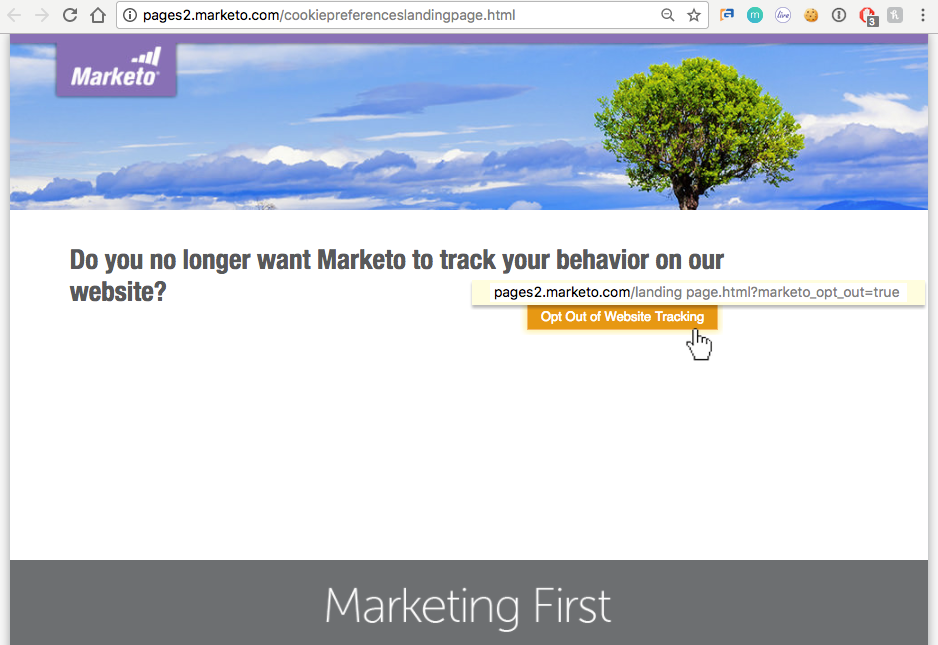

# Privacy-instellingen begrijpen {#understanding-privacy-settings}

## Overzicht {#overview}

Marketo biedt marketeers een manier om ervoor te zorgen dat webbezoekers hun toestemming geven om ze te volgen. Er zijn twee manieren om te weigeren, of u kunt verkiezen om door geanonimiseerde IP worden gevolgd.

* Webbezoekers selecteren de DNT-functie (Do Not Track) in hun browser (en de markeerfunctie houdt rekening met de aanvraag van de webbezoeker voor Niet bijhouden)
* Webbezoekers gebruiken een uitschakelcookie die door een marketeter op een website wordt aangeboden

Of, kan de telleraar gebruikers volgen, maar gebruik anonymized IP.

Deze methoden kunnen van invloed zijn op de waarde en functionaliteit van Marketo op specifieke gebieden. Als de markeerteken echter *niet* Als u iets wilt wijzigen in de Marketo-configuratie, blijft de Marketo-functionaliteit hetzelfde.

## Browserinstellingen voor Niet bijhouden {#browser-settings-for-do-not-track}

Webbezoekers kunnen hun browser zo instellen dat websites niet kunnen worden bijgehouden door &#39;&#39;Niet bijhouden&#39;&#39; (DNT) te kiezen. Hierdoor wordt het bijhouden van gegevens voor deze browser en dit apparaat voorkomen. Zie de privacyinstellingen van de browser voor meer informatie.

In Munchkin kan een markeerteken [beslissen of de DNT-instelling van de browser wordt ondersteund of genegeerd](/help/marketo/product-docs/administration/settings/edit-do-not-track-browser-support-settings.md).

In de Personalisatie van het Web, kan een teller beslissen of te [de DNT-instelling van de browser ondersteunen of negeren](/help/marketo/product-docs/web-personalization/getting-started/setting-web-personalization-to-do-not-track.md).

## Weigeren van een specifieke website {#opt-out-from-a-specific-website}

U kunt bezoekers van de site ook toestaan om websitetracering van uw website te weigeren, ongeacht of **Browser niet bijhouden** worden instellingen geconfigureerd. Hierdoor kan de bezoeker van de site zijn voorkeuren voor bijhouden rechtstreeks vanaf uw website opgeven.

Hiervoor moet u een parameter toevoegen aan een koppeling om te weigeren op een webpagina waarop de functie voor het bijhouden van servetten is ingeschakeld. Dit kan elke webpagina zijn, maar de koppeling naar de webpagina moet de volgende parameter bevatten:

?marketo_opt_out=true

Hieronder ziet u voorbeelden van een webpagina met een koppeling om te weigeren en een bestemmingspagina voor nadat op de koppeling is geklikt. U zult variëren.

Hier is een webpagina met een knop met de parameter &quot;?marketo_opt_out=true&quot; in de opt-out-koppeling.

U kunt een landingspagina maken en publiceren als een vervolgpagina voor wanneer op uw koppeling met de parameter &quot;?marketo_opt_out=true&quot; wordt geklikt.

Wanneer op de koppeling wordt geklikt, voegt Marketo een cookie met de naam **mkto_opt_out** naar de browser van de bezoeker die het bijhouden van Munchkin uitschakelt voor de bezoeker van de site die op de koppeling met de bovenstaande parameter klikt.

Als u wilt controleren of de cookie kan worden geplant, controleert u of u een gekoelde lead bent en klikt u op de koppeling. Controleer vervolgens uw browsercookies om te controleren of de **mkto_opt_out** cookie toegevoegd.

>[!NOTE]
>
>Dit werkt momenteel alleen met Munchkin versie 152 en hoger.

## Aanmelden {#opt-in}

Marketers kunnen gebruikers de mogelijkheid bieden zich aan te melden door gebruik te maken van Marketo-mogelijkheden in e-mails, formulieren, bestemmingspagina&#39;s en andere methoden.

## Het volgen die een Geanonymized IP gebruiken {#tracking-using-an-anonymized-ip}

Marketers kunnen de privacy beschermen door gebruikers met een geanonimiseerd IP-adres te volgen. Om dat te doen, voeg deze code aan RTP of Munchkin Javascript toe die in de website wordt ingebed.

* Voeg voor Munchkin {&quot;anonymizeIP&quot;,true} toe aan de init-functie.

   >[!NOTE]
   >
   >Wanneer deze parameter wordt gebruikt, moet Munchkin V2 zijn ingeschakeld. Neem contact op met [Marketo-ondersteuning](https://nation.marketo.com/community/support_solutions).

* Voor Personalisatie van het Web (RTP), voeg dit aan javascript toe:

`anonymize IP : before calling rtp('send','view'); add rtp('set', 'settings', {'anonymizeIP' : true});`
