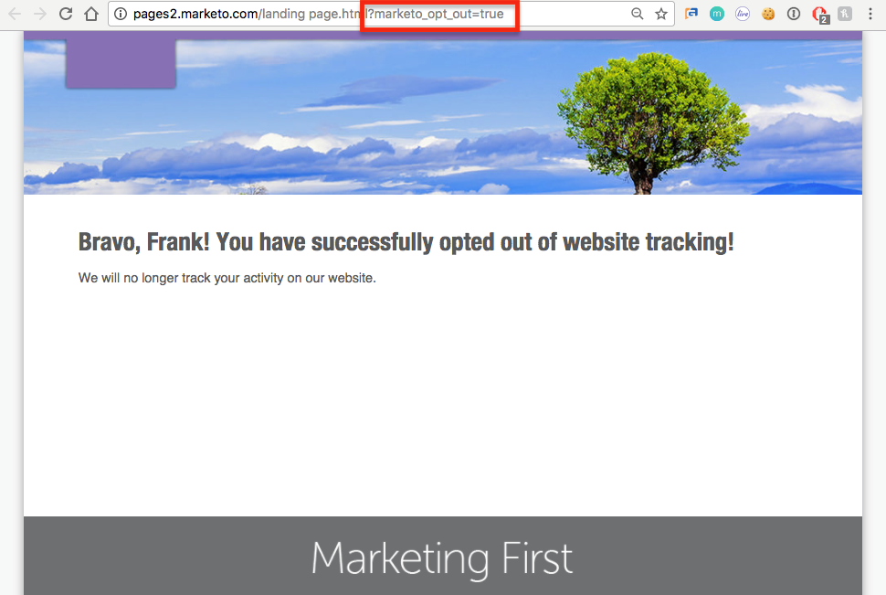
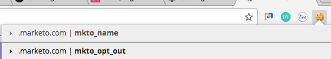

# Privacy-instellingen begrijpen {#understanding-privacy-settings}

## Overzicht {#overview}

Marketo biedt marketeers een manier om ervoor te zorgen dat webbezoekers hun toestemming geven om ze te volgen. Er zijn twee manieren om te weigeren, of u kunt verkiezen om door geanonimiseerde IP worden gevolgd.

* Webbezoekers selecteren de DNT-functie (Do Not Track) in hun browser (en de markeerfunctie houdt rekening met de aanvraag van de webbezoeker voor Niet bijhouden)
* Webbezoekers gebruiken een uitschakelcookie die door een marketeter op een website wordt aangeboden

Of, kan de telleraar gebruikers volgen, maar gebruik anonymized IP.

Deze methoden kunnen van invloed zijn op de Marketo-waarde en -functionaliteit in specifieke gebieden. Nochtans, als de telleraar _om het even wat_ verandert in de configuratie van Marketo, blijft de functionaliteit van Marketo het zelfde.

## Browserinstellingen voor Niet bijhouden {#browser-settings-for-do-not-track}

Webbezoekers kunnen hun browser zo instellen dat websites niet kunnen worden bijgehouden door &#39;&#39;Niet bijhouden&#39;&#39; (DNT) te kiezen. Hierdoor wordt het bijhouden van gegevens voor deze browser en dit apparaat voorkomen. Zie de privacyinstellingen van de browser voor meer informatie.

In [!DNL Munchkin], kan een teller [&#x200B; beslissen of om DNT van browser te steunen of te negeren plaatsend &#x200B;](/help/marketo/product-docs/administration/settings/edit-do-not-track-browser-support-settings.md).

In Personalization van het Web, kan een teller beslissen of [&#x200B; steun of het browser het plaatsen van DNT &#x200B;](/help/marketo/product-docs/web-personalization/getting-started/setting-web-personalization-to-do-not-track.md) negeren.

## Weigeren van een specifieke website {#opt-out-from-a-specific-website}

U kunt plaatsbezoekers ook toestaan om uit website het volgen van uw website te weigeren, ongeacht of **Browser** montages niet wordt gevormd. Hierdoor kan de bezoeker van de site zijn voorkeuren voor bijhouden rechtstreeks vanaf uw website opgeven.

Hiervoor moet u een parameter toevoegen aan een koppeling om te weigeren op een webpagina waarop [!DNL Munchkin] tracking is ingeschakeld. Dit kan elke webpagina zijn, maar de koppeling naar de webpagina moet de volgende parameter bevatten:

?marketo_opt_out=true

Hieronder ziet u voorbeelden van een webpagina met een koppeling om te weigeren en een bestemmingspagina voor nadat op de koppeling is geklikt. U zult variëren.

Hier is een webpagina met een knop met de parameter &quot;?marketo_opt_out=true&quot; in de opt-out-koppeling.

U kunt een landingspagina maken en publiceren als een vervolgpagina voor wanneer op uw koppeling met de parameter &quot;?marketo_opt_out=true&quot; wordt geklikt.

Wanneer de verbinding wordt geklikt, voegt Marketo een koekje genoemd **mkto_opt_out** aan browser van de bezoeker toe die [!DNL Munchkin] het volgen voor de plaatsbezoeker onbruikbaar maakt die de verbinding met de bovengenoemde parameter klikt.

Als u wilt controleren of de cookie kan worden geplant, controleert u of u een gekoelde lead bent en klikt u op de koppeling. Dan controleer uw browser koekjes om te verifiëren dat het **mkto_opt_out** koekje werd toegevoegd.

>[!NOTE]
>
>Dit werkt momenteel alleen met [!DNL Munchkin] versies 152 en hoger.

## Aanmelden {#opt-in}

Marketers kunnen gebruikers de mogelijkheid bieden zich aan te melden door gebruik te maken van Marketo-mogelijkheden in e-mails, formulieren, bestemmingspagina&#39;s en andere methoden.

## Het volgen die een Geanonymized IP gebruiken {#tracking-using-an-anonymized-ip}

Marketers kunnen de privacy beschermen door gebruikers met een geanonimiseerd IP-adres te volgen. Hiervoor voegt u deze code toe aan de RTP of [!DNL Munchkin] Javascript die in de website is ingesloten.

* Voeg voor [!DNL Munchkin] alleen {&quot;anonymizeIP&quot;,true} toe aan de init-functie.

  >[!NOTE]
  >
  >Wanneer u deze parameter gebruikt, moet [!DNL Munchkin] V2 zijn ingeschakeld. Om het te krijgen toegelaten voor uw abonnement, gelieve te contacteren {de Steun van 0} Marketo [.](https://nation.marketo.com/community/support_solutions)

* Voor Web Personalization (RTP), voeg dit aan javascript toe:

`anonymize IP : before calling rtp('send','view'); add rtp('set', 'settings', {'anonymizeIP' : true});`
