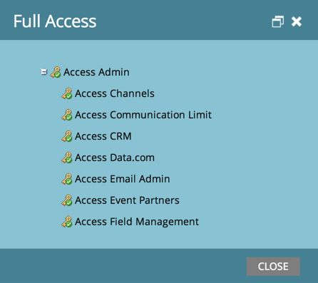

# Controleren welke machtigingen u hebt {#find-out-what-permissions-you-have}

Als je je afvraagt welke machtigingen je hebt of niet in Marketo, dan is er een eenvoudige manier om uit te zoeken.

1. Ga naar **[!UICONTROL Marketing Activities]**.

   

1. Klikken **[!UICONTROL Full Access]** om de machtigingen te zien die u hebt.

   

U zult de toestemmingen zien die uit worden vermeld.

Neem contact op met uw Marketo-beheerder als u machtigingen voor u nodig hebt.
