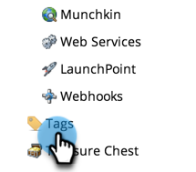

# Nieuwe programmatag- en tagwaarden maken {#create-a-new-program-tag-and-tag-values}

>[!NOTE]
>
>**Vereiste Bevoegdheden Admin**

U kunt douane [ markeringen ](/help/marketo/product-docs/core-marketo-concepts/programs/working-with-programs/understanding-tags.md) voor uw programma&#39;s tot stand brengen en waarden toewijzen aan de markering.

>[!NOTE]
>
>**Voorbeeld**
>
>Programmatag: Doelpubliek
>
>Waarde van programmalabel: SMB, Enterprise, MidMarket

1. Ga naar het **[!UICONTROL Admin]** -gebied.

   

1. Klik op **[!UICONTROL Tags]**.

   

1. Klik op **[!UICONTROL New]** en selecteer **[!UICONTROL New Tag Type]** .

   

1. Voer de tags **[!UICONTROL Tag Type]** en **[!UICONTROL Value]** in. Klik vervolgens op **[!UICONTROL Add Another]** .

   

1. Voer zoveel waarden in als u nodig hebt. Selecteer op welke programmatypen u deze tag wilt toepassen.

   

   >[!TIP]
   >
   >U kunt meerdere programmatypen selecteren. Wanneer een nieuw programma wordt gemaakt, is dit type code beschikbaar.

1. Controleer **[!UICONTROL Required]** en klik op **[!UICONTROL Create]** .

   

   >[!NOTE]
   >
   >Als het tagtype **[!UICONTROL Required]** is, moeten gebruikers een waarde voor de tag invoeren wanneer ze een nieuw programma maken.

   

Wanneer uw gebruikers nu een programma maken, moeten ze de aangepaste waarde voor de gemaakte tag instellen.
