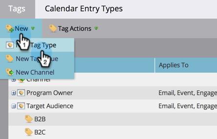

# Nieuwe programmatag- en tagwaarden maken {#create-a-new-program-tag-and-tag-values}

>[!NOTE]
>
>**Beheerdersmachtigingen vereist**

U kunt aangepaste [tags](/help/marketo/product-docs/core-marketo-concepts/programs/working-with-programs/understanding-tags.md) voor uw programma&#39;s en geef waarden op aan de tag.

>[!NOTE]
>
>**Voorbeeld**
>
>Programmatag: Doelpubliek
>
>Waarde van programmalabel: SMB, Onderneming, Midden-Markt

1. Ga naar de **[!UICONTROL Admin]** gebied.

   

1. Klik op **[!UICONTROL Tags]**.

   

1. Klik op **[!UICONTROL New]** en selecteer **[!UICONTROL New Tag Type]**.

   

1. Voer de **[!UICONTROL Tag Type]** en een tag **[!UICONTROL Value]**. Klik vervolgens op **[!UICONTROL Add Another]**.

   

1. Voer zoveel waarden in als u nodig hebt. Selecteer op welke programmatypen u deze tag wilt toepassen.

   

   >[!TIP]
   >
   >U kunt meerdere programmatypen selecteren. Wanneer een nieuw programma wordt gemaakt, is dit type code beschikbaar.

1. Controleren **[!UICONTROL Required]** en klik op **[!UICONTROL Create]**.

   

   >[!NOTE]
   >
   >Als het labeltype **[!UICONTROL Required]**, moeten gebruikers een waarde voor de tag invoeren wanneer ze een nieuw programma maken.

   

Wanneer uw gebruikers nu een programma maken, moeten ze de aangepaste waarde voor de gemaakte tag instellen.
