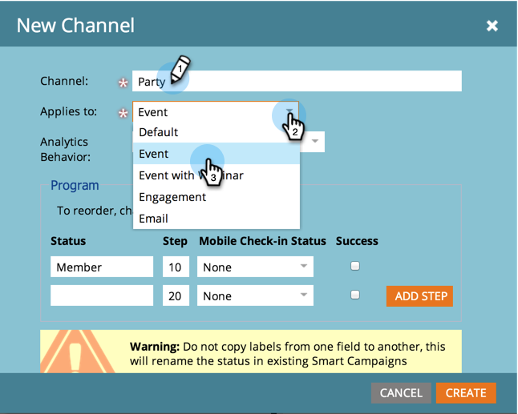
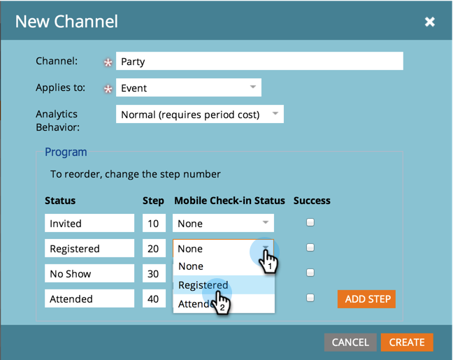

# Een programmakanaal maken {#create-a-program-channel}

Een programma is een specifiek marketinginitiatief. Het kanaal is bedoeld om het leveringsmechanisme te zijn, zoals Webinar of Sponsorship of Online Advertentie.

>[!NOTE]
>
>**Vereiste Bevoegdheden Admin**

>[!NOTE]
>
>Leer meer over [&#x200B; programma&#39;s &#x200B;](/help/marketo/product-docs/core-marketo-concepts/programs/creating-programs/understanding-programs.md), het belangrijkste element in Marketo.

1. Ga naar het **[!UICONTROL Admin]** -gebied.

   

1. Klik op **[!UICONTROL Tags]**.

   

   >[!NOTE]
   >
   >Waarom tags? Een kanaal is een manier om een programma te beschrijven, net als andere tags. Het kanaal heeft alleen speciale extra functies.

1. Klik op het plusteken **+** naast [!UICONTROL Channel] om bestaande kanalen uit te vouwen en weer te geven.

   

1. Klik onder **[!UICONTROL New]** op **[!UICONTROL New Channel]** .

   

   >[!NOTE]
   >
   >**Voorbeeld**
   >
   >Kanaal: Billboard
   >
   >* Toepassen op: standaard
   >* Progressie: lid, betrokken (bij twijfel werken deze prima)
   >* Geslaagd: Betrokken
   >
   >Kanaal: Feest
   >
   >* Toepassen op: gebeurtenis
   >* Progressie: Uitgenodigd, Geregistreerd, Geen Show en Bijgewoond
   >* Succes: bijgewoond
   >
   >Bekijk de Progressies van bestaande kanalen om een idee te krijgen van hoe u ze kunt gebruiken.

1. Laten we het kanaalvoorbeeld van de Partij volgen. Geef uw nieuwe **[!UICONTROL Channel]** een naam en selecteer het programmatype waarop deze van toepassing is.

   

   >[!NOTE]
   >
   >Toepassen op wat? Er zijn verschillende soorten programma&#39;s. Pas het kanaal aan de juiste type aan. Kies bij twijfel **[!UICONTROL Default]** .

   >[!NOTE]
   >
   >Wanneer het gebruiken van &quot;[!UICONTROL Event with Webinar],&quot;systeemafbeeldingen (zoals vereist door webinar integratie) zal worden gesloten en kan niet worden uitgegeven.

1. Voer de eerste twee statusnamen van het programma in en klik op **[!UICONTROL Add Step]** .

   

1. Voer een ander programma **[!UICONTROL Status]** en **[!UICONTROL Step]** nummer in en klik op **[!UICONTROL Add Step]** .

   

   >[!TIP]
   >
   >Het **[!UICONTROL Step]** -getal wordt gebruikt voor het sorteren van de status van het programma. Houd er rekening mee dat mensen in deze progressiestappen niet terug kunnen gaan. Ze kunnen alleen de status wijzigen in een hogere of gelijke waarde. Gebruik dezelfde waarden als statussen bedoeld zijn om heen en weer te schakelen in plaats van progressie.

1. Voer het laatste programma **[!UICONTROL Status]** en **[!UICONTROL Step]** nummer in.

   

   >[!NOTE]
   >
   >Wanneer het gebruiken van het type &quot;[!UICONTROL Event],&quot;systeemafbeelding voor Geregistreerde, Waitlist, en Bijgewoonde statussen wordt vereist. Deze statussen kunnen daarom niet worden verborgen.

1. Kies de lus **[!UICONTROL Mobile Check-in Status]** for **[!UICONTROL Registered]** .

   

1. Kies de lus **[!UICONTROL Mobile Check-in Status]** for **[!UICONTROL Attended]** .

   

   >[!NOTE]
   >
   >**[!UICONTROL Mobile Check-in Status]** -opties zijn alleen beschikbaar als het kanaal bestemd is voor gebeurtenisprogramma&#39;s.

   >[!NOTE]
   >
   >Slechts zullen de mensen met a **[!UICONTROL Mobile Check-in Status]** van **[!UICONTROL Registered]** en **[!UICONTROL Attended]** in [&#x200B; Mobiele Controle-binnen Apps &#x200B;](/help/marketo/product-docs/core-marketo-concepts/mobile-apps/event-check-in/event-check-in-overview.md) zichtbaar zijn.

   >[!TIP]
   >
   >Als er een nieuwe persoon wordt gemaakt in de mobiele incheckapp, wordt deze ingesteld op [!UICONTROL Registered] in het gebeurtenisprogramma. Als een persoon is aangemeld bij de gebeurtenis op de app, wordt deze ingesteld op [!UICONTROL Attended] in het gebeurtenisprogramma.

1. Selecteer de status van het **[!UICONTROL Success]** -programma en klik op **[!UICONTROL Create]** .

   

   Echt waar! Wanneer u een nieuw programma van dat type maakt, zal dit nieuwe kanaal één van de keuzen zijn.
