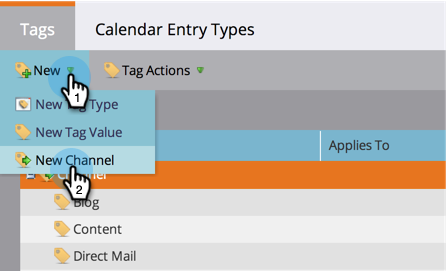

# Programmakanaal {#create-a-program-channel} maken

Een programma is een specifiek marketinginitiatief. Het kanaal is bedoeld om het leveringsmechanisme te zijn, zoals Webinar of Sponsorship of Online Advertentie.

>[!NOTE]
>
>**Beheerdersmachtigingen vereist**

>[!NOTE]
>
>Meer informatie over [programma&#39;s](/help/marketo/product-docs/core-marketo-concepts/programs/creating-programs/understanding-programs.md), het belangrijkste element in Marketo.

1. Klik onder de sectie **Admin** op **Codes**.

   

   >[!NOTE]
   >
   >Waarom tags? Een kanaal is een manier om een programma te beschrijven, net als andere tags. Het kanaal heeft alleen speciale extra functies.

1. Klik **+** teken naast **Kanaal** om bestaande kanalen uit te breiden en te zien.

   

1. Klik onder **Nieuw** op **Nieuw kanaal**.

   

   >[!NOTE]
   >
   >**Voorbeeld**
   >
   >Kanaal: Billboard
   >
   >* Toepassen op: Standaard
   >* Progressie: Lid, Betrokken (bij twijfel werken deze prima)
   >* Geslaagd: Betrokken

   >
   >Kanaal: Feest
   >
   >* Toepassen op: Gebeurtenis
   >* Progressie: Uitgenodigd, Geregistreerd, Geen Show en Bijgewoond
   >* Geslaagd: Bijgewoond

   >
   >Bekijk de Progressies van bestaande kanalen om een idee te krijgen van hoe u ze kunt gebruiken.

1. Laten we het kanaalvoorbeeld van de Partij volgen. Noem uw nieuw **Kanaal** en selecteer het programmatype het op zal van toepassing zijn.

   

   >[!NOTE]
   >
   >Toepassen op wat? Er zijn verschillende soorten programma&#39;s. Pas het kanaal aan de juiste type aan. Kies bij twijfel **Standaard**.

   >[!NOTE]
   >
   >Wanneer u &quot;Gebeurtenis met webinar&quot; gebruikt, worden systeemtoewijzingen vergrendeld (zoals vereist door webinar-integratie) en kunnen deze niet worden bewerkt.

   Voer de eerste twee statusnamen van het programma in en klik op Stap toevoegen.
   

1. Typ een ander programma **Status** en **Step** nummer en klik vervolgens op **Stap toevoegen**.

   

   >[!TIP]
   >
   >Het **Step** aantal wordt gebruikt voor het sorteren van programmastatussen. Houd er rekening mee dat mensen in deze progressiestappen niet terug kunnen gaan. Ze kunnen alleen de status wijzigen in een hogere of gelijke waarde. Gebruik dezelfde waarden als statussen bedoeld zijn om heen en weer te schakelen in plaats van progressie.

1. Voer het laatste programma **Status** en **Step** aantal in.

   

   >[!NOTE]
   >
   >Wanneer u het type &quot;Event&quot; gebruikt, is systeemtoewijzing voor de statussen Registered, Waitlist en Attended vereist. Deze statussen kunnen daarom niet worden verborgen.

1. Kies de **Status mobiele inchecken** voor **Geregistreerd**.

   

1. Kies de **status van de mobiele inchecking** voor **Bijgevoegd**.

   

   >[!NOTE]
   >
   >**De status** van de mobiele inchecken**** opties zijn alleen beschikbaar als het kanaal bestemd is voor gebeurtenisprogramma&#39;s.

   >[!NOTE]
   >
   >Alleen personen met een **Mobiele incheckstatus** van **Geregistreerde** en **Bijgewoonde** zijn zichtbaar in de [Mobiele incheckapps](/help/marketo/product-docs/core-marketo-concepts/mobile-apps/event-check-in/event-check-in-overview.md).

   >[!TIP]
   >
   >Als er een nieuwe persoon wordt gemaakt in de mobiele incheckapp, wordt deze ingesteld op Ingeschreven in het gebeurtenisprogramma. Als een persoon is aangemeld bij de gebeurtenis op de app, wordt deze ingesteld op Bijwonen in het gebeurtenisprogramma.

1. Selecteer **Success** programmastatus, dan klik **Create**.

   

   Echt waar! Wanneer u een nieuw programma van dat type maakt, zal dit nieuwe kanaal één van de keuzen zijn.
