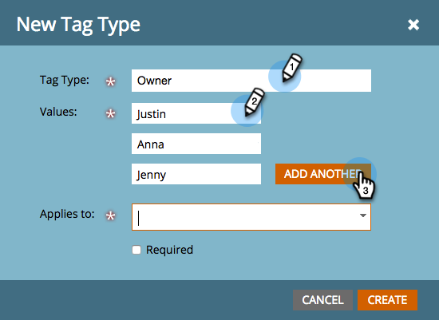

# Aangepaste tags maken {#create-custom-tags}

Met tags kunt u uw programma&#39;s ordenen terwijl de kanalen helpen bij het verzamelen van gegevens voor rapportagedoeleinden.

>[!NOTE]
>
>**Diep duiken**
>
>Raadpleeg Tags voor [begrip](../../../product-docs/core-marketo-concepts/programs/working-with-programs/understanding-tags.md) voor meer informatie.

>[!NOTE]
>
>**Beheerdersmachtigingen vereist**

## Een nieuw tagtype maken {#create-a-new-tag-type}

Een nieuw type code maken:

1. Ga naar de sectie **Beheer** .

   

1. Klik op **Labels**.

   

1. Klik op **Nieuw** en selecteer **Nieuw tagtype.**

   

1. Voer een naam in voor het **tagtype**.

   

1. Voer de gewenste **waarde** in voor het tagtype. Klik op Nog een **toevoegen** om extra tagwaarden in te voeren.

   

1. Selecteer op welke programma&#39;s deze tag van toepassing is.

   

   >[!NOTE]
   >
   >Selecteer **Vereist voor alle programma&#39;s** om deze tag toe te voegen wanneer een nieuw programma wordt gemaakt.

1. Klik op **Maken** om op te slaan.

   

   Dat is het! U kunt nu aangepaste tags maken voor uw programma&#39;s.
