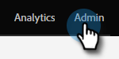

# Aangepaste tags maken {#create-custom-tags}

Met tags kunt u uw programma&#39;s ordenen terwijl de kanalen helpen bij het verzamelen van gegevens voor rapportagedoeleinden.

>[!NOTE]
>
>Controle uit [ Begrijpend Markeringen ](/help/marketo/product-docs/core-marketo-concepts/programs/working-with-programs/understanding-tags.md) voor meer informatie.

>[!NOTE]
>
>**Vereiste Bevoegdheden Admin**

## Een nieuw tagtype maken {#create-a-new-tag-type}

Een nieuw type code maken:

1. Ga naar de sectie **[!UICONTROL Admin]** .

   

1. Klik op **[!UICONTROL Tags]**.

   

1. Klik op **[!UICONTROL New]** en selecteer **[!UICONTROL New Tag Type]** .

   

1. Voer een naam in voor het tagtype.

   

1. Voer de gewenste waarde in voor het tagtype. Klik op **[!UICONTROL Add Another]** om extra waarden in te voeren.

   

1. Selecteer op welk programmatype(n) deze tag van toepassing is.

   

1. Bepaal of u deze tag al dan niet wilt gebruiken voor alle vermelde programmatypen.

   

   >[!NOTE]
   >
   >* Selecteer &quot;[!UICONTROL Required]&quot; als u wilt dat deze tag wordt toegevoegd telkens wanneer een nieuw programma wordt gemaakt.
   >* Als u een programmatype verwijdert uit de lijst &#39;[!UICONTROL Applies to]&#39;, worden de tag en de bijbehorende waarden verwijderd uit alle bestaande programma&#39;s van dat type. Als u bestaande markeringswaarden wilt bewaren en deze markering facultatief maken die zich voor _vooruit beweegt alle_ vermelde programmatypes, verlaat &quot;Vereist&quot;checkbox niet geselecteerd.

   >[!TIP]
   >
   >Als u een gelijkaardige markering wilt maken die voor sommige programmatypes maar facultatief voor anderen wordt vereist, zult u opstelling twee afzonderlijke markeringen moeten, elk die op verschillende programmatypes met één met &quot;[!UICONTROL Required]&quot;wordt toegepast geselecteerd, en andere met &quot;[!UICONTROL Required]&quot;niet geselecteerd.

1. Klik op **[!UICONTROL Create]**.

   
