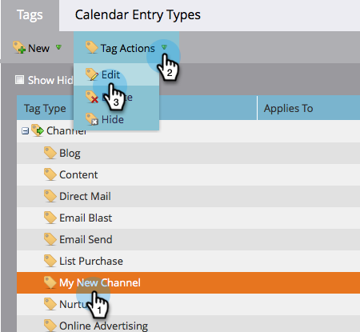

# De status van een programma verwijderen uit een programmakanaal {#delete-a-program-status-from-a-program-channel}

De status van het programma is de controlepunten door een programmaweg (kanaal). Als u per ongeluk een status maakt of deze niet meer nodig hebt, kunt u deze zonder problemen verwijderen.

1. Ga naar het **[!UICONTROL Admin]** -gebied.

   

1. Klik op **[!UICONTROL Tags]**.

   

1. Selecteer het kanaal waarvan u een status wilt verwijderen en klik vervolgens onder **[!UICONTROL Tag Actions]** op **[!UICONTROL Edit]** .

   

1. Klik rode **X** om de status te verwijderen, dan klik **[!UICONTROL Save]**.

   

   >[!TIP]
   >
   >Als iemand momenteel aan de desbetreffende status is toegewezen, kunt u deze niet verwijderen, maar kunt u deze wel verbergen.

Echt waar! U kunt ook [&#x200B; een volledig kanaal &#x200B;](/help/marketo/product-docs/administration/tags/delete-a-program-channel.md) schrappen als u moet.
