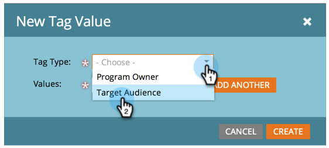
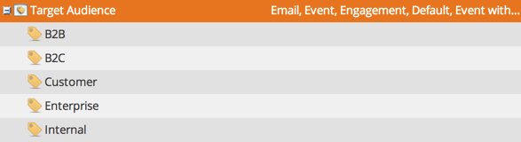

# Tagwaarden beheren {#managing-tag-values}

[Tagsare ](/help/marketo/product-docs/core-marketo-concepts/programs/working-with-programs/understanding-tags.md) wordt gebruikt om programma&#39;s te beschrijven. U kunt zo veel maken als u nodig hebt, elk met unieke waarden. Hieronder wordt beschreven hoe u deze waarden beheert.

>[!NOTE]
>
>**Beheerdersmachtigingen vereist**

>[!PREREQUISITES]
>
>[Nieuwe programmatag- en tagwaarden maken](/help/marketo/product-docs/administration/tags/create-a-new-program-tag-and-tag-values.md)

## Tagwaarden {#adding-tag-values} toevoegen

1. Klik onder **Admin** op **Codes**.

   

1. Klik **Nieuw**, dan **Nieuwe tagwaarde**.

   

1. Selecteer **Tagtype**.

   

1. Voer een **Waarde** in en klik **Nog een** toevoegen. U kunt zoveel waarden toevoegen als u wilt.

   

1. Voeg de resterende waarden toe en klik **Maken**.

   

1. U moet de wijzigingen direct zien!

   

## Tagwaarden {#hiding-tag-values} verbergen

Tags kunnen door oude programma&#39;s worden gebruikt. U kunt deze vervangen voor toekomstig gebruik door het type code te verbergen.

1. Selecteer **Tag** en selecteer **Waarde** u wilt verbergen.

   

1. Selecteer **Verbergen** onder **Handelingen labelen**.

   

## Verborgen waarden {#show-hidden-values} tonen

Ga als volgt te werk als u de verborgen waarden weer wilt zien:

1. Selecteer het vak Verborgen weergeven. Als deze optie is ingeschakeld, ziet u de verborgen waarde.

   

Vervolgens kunt u de waarden die u in de toekomst wilt gebruiken, zichtbaar maken.
