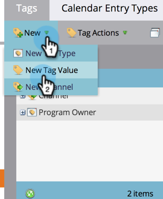

# Tagwaarden beheren {#managing-tag-values}

[ de Markeringen ](/help/marketo/product-docs/core-marketo-concepts/programs/working-with-programs/understanding-tags.md) worden gebruikt om programma&#39;s te beschrijven. U kunt zo veel maken als u nodig hebt, elk met unieke waarden. Hieronder wordt beschreven hoe u deze waarden beheert.

>[!NOTE]
>
>**Vereiste Bevoegdheden Admin**

>[!PREREQUISITES]
>
>[ creeer een Nieuwe Markering van het Programma en de Waarden van de Markering ](/help/marketo/product-docs/administration/tags/create-a-new-program-tag-and-tag-values.md)

## Tagwaarden toevoegen {#adding-tag-values}

1. Ga naar het **[!UICONTROL Admin]** -gebied.

   

1. Klik op **[!UICONTROL Tags]**.

   

1. Klik op **[!UICONTROL New]** en vervolgens op **[!UICONTROL New Tag Value]** .

   

1. Selecteer de **[!UICONTROL Tag Type]** .

   

1. Voer een **[!UICONTROL Value]** in en klik op **[!UICONTROL Add Another]** . U kunt zoveel waarden toevoegen als u wilt.

   

1. Voeg de resterende waarden toe en klik op **[!UICONTROL Create]** .

   

U moet de wijzigingen direct zien!

## Tagwaarden verbergen {#hiding-tag-values}

Tags kunnen door oude programma&#39;s worden gebruikt. U kunt deze vervangen voor toekomstig gebruik door het type code te verbergen.

1. Selecteer de **[!UICONTROL Tag]** en selecteer de **[!UICONTROL Value]** die u wilt verbergen.

   

1. Selecteer onder **[!UICONTROL Tag Actions]** de optie **[!UICONTROL Hide]** .

   

## Verborgen waarden tonen {#show-hidden-values}

Ga als volgt te werk als u de verborgen waarden weer wilt zien:

1. Schakel het selectievakje **[!UICONTROL Show Hidden]** in. Als deze optie is ingeschakeld, ziet u de verborgen waarde.

   

Vervolgens kunt u de waarden die u in de toekomst wilt gebruiken, zichtbaar maken.
