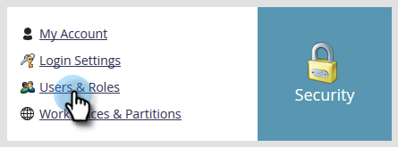

# Een gebruikersrol maken die alleen een API is {#create-an-api-only-user-role}

Als u met Marketo via [REST API](https://developers.marketo.com/documentation/rest/) wilt integreren, is de beste praktijk om [een gebruiker de slechts API rol ](/help/marketo/product-docs/administration/users-and-roles/create-an-api-only-user.md) toe te wijzen en dan [een douanedienst voor gebruik met ReST API te creëren](/help/marketo/product-docs/administration/additional-integrations/create-a-custom-service-for-use-with-rest-api.md). Hieronder wordt beschreven hoe u de alleen-API-gebruikersrol maakt.

>[!NOTE]
>
>**Beheerdersmachtigingen vereist**

1. Klik in Mijn Marketo op **Admin**.

   

1. Klik onder Beveiliging op **Gebruikers en rollen**.

   

1. Klik op het tabblad **Rollen** en vervolgens **Nieuwe rol**.

   

1. Voer een rolnaam in, selecteer de API-toegangsmachtigingen die u wilt geven en klik op **Maken.**

   

>[!TIP]
>
>Het is altijd een goed idee om slechts de vereiste minimumtoestemmingen te verlenen.

>[!MORELIKETHIS]
>
>Goed gedaan! Laten we nu [een gebruiker met alleen API maken](/help/marketo/product-docs/administration/users-and-roles/create-an-api-only-user.md).
