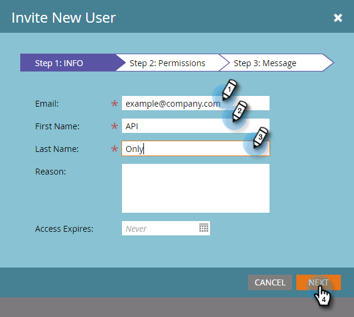

# Alleen een API-gebruiker maken {#create-an-api-only-user}

Als u met Marketo via [ REST API ](https://experienceleague.adobe.com/nl/docs/marketo-developer/marketo/rest/rest-api){target="_blank"} wilt integreren, zult u een slechts gebruiker API moeten creëren. Zo gaat het.

>[!IMPORTANT]
>
>Als u API slechts gebruikers in een abonnement creeert dat aan de Identiteit van Adobe is bezet, zijn uw stappen verschillend en [ kan hier ](/help/marketo/product-docs/administration/marketo-with-adobe-identity/add-api-only-user-for-adobe-ims-enabled-subscriptions.md){target="_blank"} worden gevonden.

>[!PREREQUISITES]
>
>[ creeer een slechtsAPI Rol van de Gebruiker ](/help/marketo/product-docs/administration/users-and-roles/create-an-api-only-user-role.md){target="_blank"}

>[!NOTE]
>
>**Vereiste Bevoegdheden Admin**

1. Ga naar het **[!UICONTROL Admin]** -gebied.

   

1. Klik op **[!UICONTROL Users & Roles]**.

   

1. Klik op **[!UICONTROL Invite New User]**.

   

1. Voer een e-mail, voornaam en achternaam in voor alleen de gebruiker van de API. Klik op **[!UICONTROL Next]**.

   

   >[!TIP]
   >
   >Voeg een optionele [!UICONTROL Reason] of een [!UICONTROL Access Expiration] datum toe. De vervaldata van de toegang zijn handig voor kortetermijnwerknemers.

1. Selecteer de **[!UICONTROL API Only]** rol en schakel het selectievakje **[!UICONTROL API Only]** in. Klik op **[!UICONTROL Next]**.

   

1. Klik op **[!UICONTROL Send]**.

   

>[!NOTE]
>
>In de pop-up staat: &quot;Een uitnodiging is niet alleen vereist voor API,&quot; maar dat betekent niet dat je iets verkeerd hebt gedaan. Het betekent gewoon dat we de rol zullen creëren zonder dat er een uitnodigings-e-mail moet worden verzonden.

Aldus terecht! Laten we nu de aangepaste service maken.

>[!MORELIKETHIS]
>
>[ creeer een Dienst van de Douane voor Gebruik met REST API ](/help/marketo/product-docs/administration/additional-integrations/create-a-custom-service-for-use-with-rest-api.md){target="_blank"}
