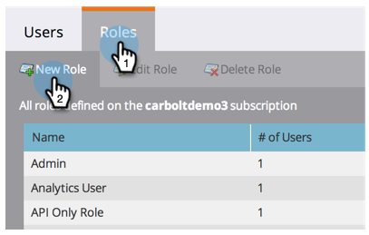
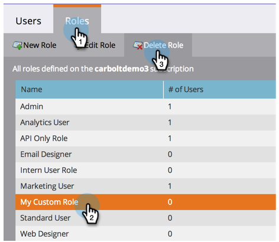
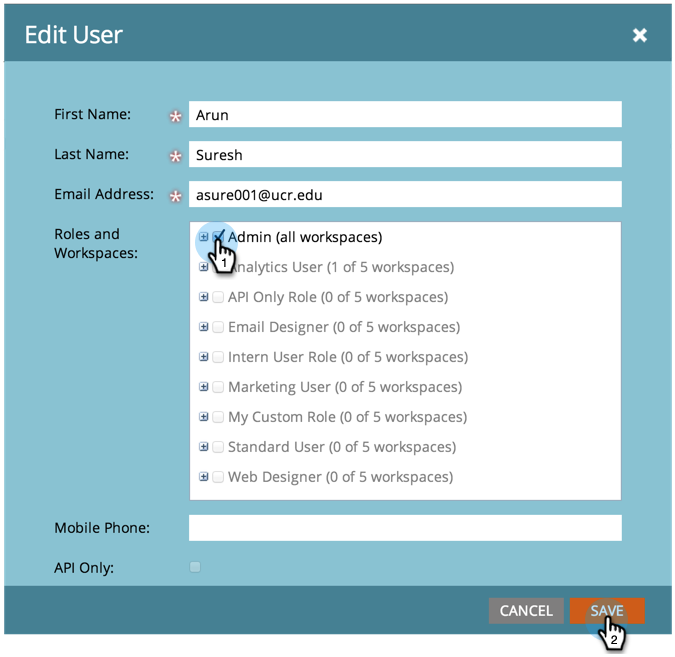

# Een gebruikersrol maken, verwijderen, bewerken en wijzigen {#create-delete-edit-and-change-a-user-role}

**** Rolesgroup een aantal machtigingen. **** Permissionsallow je om dingen te doen in Marketo. U wijst een **rol** aan een gebruiker toe. Eenvoudig als taart.

>[!NOTE]
>
>**Beheerdersmachtigingen vereist**

## Een rol maken {#create-a-role}

1. Ga naar **Admin** en klik **Gebruikers &amp; rollen**.

   

1. Ga naar **Tabblad Rollen** en klik **Nieuwe rol**.

   

1. Noem uw nieuwe rol, controleer alle toestemmingen u aan gebruikers verbonden aan de rol wilt verlenen, en klik **Create**.

   

## Een rol verwijderen {#delete-a-role}

1. Klik onder **Admin** op **Gebruikers &amp; rollen**.

   

1. Selecteer onder het tabblad **Rollen** een rol en klik op **Rol verwijderen**.

   

1. Bevestig de verwijdering door te klikken op **Delete**.

   

>[!NOTE]
>
>U moet eerst ervoor zorgen dat geen gebruikers aan een rol worden toegewezen, anders kan het niet worden geschrapt.

## Een bestaande rol bewerken {#edit-an-existing-role}

>[!NOTE]
>
>Als u uw eigen gebruikersrol wilt bewerken, moet u zich aanmelden als een andere gebruiker met beheerdersrechten.

1. Ga naar **Admin** en klik **Gebruikers &amp; rollen**.

   

1. Klik op het tabblad **Rollen**.

   

1. Selecteer de rol die u wilt bewerken en klik op **Rol bewerken**.

   

1. Breng alle gewenste wijzigingen aan en klik op **Opslaan**.

   

   >[!NOTE]
   >
   >De wijzigingen aan de rol zijn van invloed op elke gebruiker die aan deze rol is gekoppeld.

   >[!TIP]
   >
   >Wilt u het e-mailadres van uw account bijwerken? [Leer hier](/help/marketo/product-docs/administration/settings/edit-account-settings.md) hoe.

## De rol van een gebruiker wijzigen {#change-a-users-role}

1. Ga naar **Admin** en klik **Gebruikers &amp; rollen**.

   

1. Selecteer de gebruiker u een verschillende rol aan wilt toewijzen en **Gebruiker uitgeven.**

   

1. Schakel de vorige rol uit, selecteer de nieuwe en klik op **Opslaan**.

   

>[!NOTE]
>
>Als u veelvoudige rollen geselecteerd verlaat, zal Marketo aan de meest beperkende toestemming in gebreke blijven.
