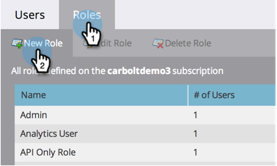
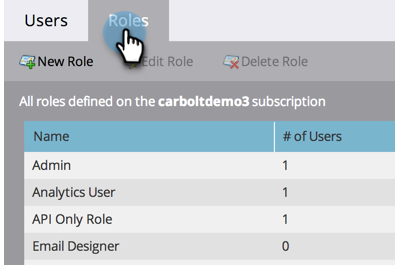

# Een gebruikersrol maken, verwijderen, bewerken en wijzigen {#create-delete-edit-and-change-a-user-role}

**Rollen** groeperen een aantal machtigingen. **Machtigingen** laat je dingen doen in Marketo. U wijst een **rol** aan een gebruiker. Eenvoudig als taart.

>[!NOTE]
>
>**Beheerdersmachtigingen vereist**

>[!IMPORTANT]
>
>De volgende rollen zijn systeemrollen en kunnen niet worden uitgegeven of worden geschrapt:
>
>* Beheer
>* Adobe-productbeheerder
>* Standaardgebruiker
>* RTP-editor
>* RTP Launcher

## Een rol maken {#create-a-role}

1. Ga naar de **Beheer** gebied.

   

1. Klikken **Gebruikers en rollen**.

   

1. Ga naar de **Tabblad Rollen** en klik op **Nieuwe rol**.

   

1. Geef uw nieuwe rol een naam, controleer alle machtigingen die u aan gebruikers die aan de rol zijn gekoppeld, wilt verlenen en klik op **Maken**.

   

## Een rol verwijderen {#delete-a-role}

1. Ga naar de **Beheer** gebied.

   

1. Klikken **Gebruikers en rollen**.

   

1. Onder de **Rollen** tab, selecteer een rol en klik op **Rol verwijderen**.

   

1. Verwijderen bevestigen door op **Verwijderen**.

   

>[!NOTE]
>
>U moet eerst ervoor zorgen dat geen gebruikers aan een rol worden toegewezen, anders kan het niet worden geschrapt.

## Een bestaande rol bewerken {#edit-an-existing-role}

>[!NOTE]
>
>Als u uw eigen gebruikersrol wilt bewerken, moet u zich aanmelden als een andere gebruiker met beheerdersrechten.

1. Ga naar de **Beheer** gebied.

   

1. Klikken **Gebruikers en rollen**.

   

1. Klik op de knop **Rollen** tab.

   

1. Selecteer de rol die u wilt bewerken en klik op **Rol bewerken**.

   

1. Breng alle gewenste wijzigingen aan en klik op **Opslaan**.

   

   >[!NOTE]
   >
   >De wijzigingen aan de rol zijn van invloed op elke gebruiker die aan deze rol is gekoppeld.

   >[!TIP]
   >
   >Wilt u het e-mailadres van uw account bijwerken? [Meer informatie hier](/help/marketo/product-docs/administration/settings/edit-account-settings.md).

## De rol van een gebruiker wijzigen {#change-a-users-role}

1. Ga naar de **Beheer** gebied.

   

1. Klikken **Gebruikers en rollen**.

   

1. Selecteer de gebruiker aan u een andere rol wilt toewijzen en klik **Gebruiker bewerken.**

   

1. Schakel de vorige rol uit, selecteer de nieuwe. Klik vervolgens op **Opslaan**.

   

>[!NOTE]
>
>Als u veelvoudige rollen geselecteerd verlaat, zal Marketo aan de meest beperkende toestemming in gebreke blijven.
