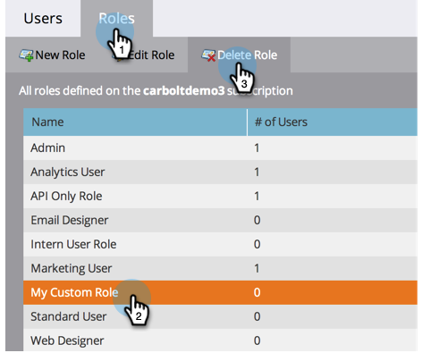

# Een gebruikersrol maken, verwijderen, bewerken en wijzigen {#create-delete-edit-and-change-a-user-role}

**Rollen** groeperen samen een groep toestemmingen. **Toestemmingen** staan u toe om dingen in Marketo te doen. U wijst a **rol** aan een gebruiker toe. Eenvoudig als taart.

>[!NOTE]
>
>**Vereiste Bevoegdheden Admin**

>[!IMPORTANT]
>
>De volgende rollen zijn systeemrollen en kunnen niet worden uitgegeven of worden geschrapt:
>
>* Beheerder
>* Adobe-productbeheerder
>* Standaardgebruiker
>* RTP-editor
>* RTP Launcher

## Een rol maken {#create-a-role}

1. Ga naar het **[!UICONTROL Admin]** -gebied.

   

1. Klik op **[!UICONTROL Users & Roles]**.

   

1. Ga naar de tab **[!UICONTROL Roles]** en klik op **[!UICONTROL New Role]** .

   

1. Geef uw nieuwe rol een naam, controleer alle machtigingen die u aan gebruikers die aan de rol zijn gekoppeld, wilt verlenen en klik op **[!UICONTROL Create]** .

   

## Een rol verwijderen {#delete-a-role}

1. Ga naar het **[!UICONTROL Admin]** -gebied.

   

1. Klik op **[!UICONTROL Users & Roles]**.

   

1. Selecteer een rol onder het tabblad **[!UICONTROL Roles]** en klik op **[!UICONTROL Delete Role]** .

   

1. Bevestig de verwijdering door op **[!UICONTROL Delete]** te klikken.

   

>[!NOTE]
>
>U moet eerst ervoor zorgen dat geen gebruikers aan een rol worden toegewezen, anders kan het niet worden geschrapt.

## Een bestaande rol bewerken {#edit-an-existing-role}

>[!NOTE]
>
>Als u uw eigen gebruikersrol wilt bewerken, moet u zich aanmelden als een andere gebruiker met beheerdersrechten.

1. Ga naar het **[!UICONTROL Admin]** -gebied.

   

1. Klik op **[!UICONTROL Users & Roles]**.

   

1. Klik op de tab **[!UICONTROL Roles]** .

   

1. Selecteer de rol die u wilt bewerken en klik op **[!UICONTROL Edit Role]** .

   

1. Breng alle gewenste wijzigingen aan en klik op **[!UICONTROL Save]** .

   

   >[!NOTE]
   >
   >De wijzigingen aan de rol zijn van invloed op elke gebruiker die aan deze rol is gekoppeld.

   >[!TIP]
   >
   >Wilt u het e-mailadres van uw account bijwerken? [&#x200B; leer hoe hier &#x200B;](/help/marketo/product-docs/administration/settings/edit-account-settings.md).

## Gebruikersrol wijzigen {#change-a-users-role}

1. Ga naar het **[!UICONTROL Admin]** -gebied.

   

1. Klik op **[!UICONTROL Users & Roles]**.

   

1. Selecteer de gebruiker aan wie u een andere rol wilt toewijzen en klik op **[!UICONTROL Edit User]** .

   

1. Schakel de vorige rol uit, selecteer de nieuwe en klik op **[!UICONTROL Save]** .

   

>[!NOTE]
>
>Als u veelvoudige rollen geselecteerd verlaat, zal Marketo aan de meest beperkende toestemming in gebreke blijven.
