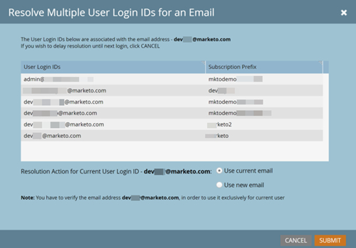

# E-mailverificatie {#email-verification}

Adobe Marketo Engage-abonnementen vereisen dat alle gebruikers die geen API gebruiken, inclusief beheerders van Marketo&#39;s Engage, hun e-mailadres verifiëren.

## Waarom deze functie is geïntroduceerd {#why-this-feature-was-introduced}

Marketo Engage gaat door met de introductie van e-mailverificatie ter voorbereiding op het migreren van klanten naar het Adobe Business Platform, inclusief de migratie van gebruikers naar Adobe-id&#39;s. Deze functie verbetert de beveiliging van bestaande gebruikersaccounts in de Marketo Engage. Om ervoor te zorgen dat een gebruiker van het Marketo Engage aan de juiste Adobe ID wordt gekoppeld, moeten bestaande gebruikers van het Marketo Engage hun e-mailadres verifiëren. Een gebruiker van een Marketo Engage moet een geverifieerd e-mailadres hebben om naar een Adobe ID te worden gemigreerd. Als een gebruiker van het Marketo Engage zijn e-mailadres niet verifieert, kan hij of zij niet naar een Adobe ID worden gemigreerd en verliest hij of zij de toegang tot een Marketo-abonnement nadat de gebruikersmigratie voor het abonnement is voltooid.

## Uitnodiging gebruiker {#user-invite}

Wanneer een Admin een gebruiker uitnodigt, wordt die gebruiker automatisch geverifieerd zodra hij op de uitnodigingskoppeling klikt.

>[!IMPORTANT]
>
>De uitzondering op het bovenstaande is: _in een SSO-abonnement_, Admins zal een nieuwe gebruikersuitnodiging ontvangen, maar gebruikers die geen Admin gebruiken zullen niet. Gebruikers die geen beheerder zijn, moeten het e-mailverificatieproces nog steeds doorlopen om migratie van hun records te garanderen. Gebruikers kunnen zichzelf de e-mailverificatiekoppeling sturen door naar **Beheerder** > **Mijn account** > **Accountinstellingen** en klikken **Verificatie opnieuw verzenden**.

## Verificatiebericht {#verification-email}

Gebruikers ontvangen de onderstaande e-mail wanneer e-mailverificatie wordt geactiveerd voor een abonnement of als deze wordt geactiveerd door een beheerder/gebruiker.

Een actieve gebruikerssessie is vereist om e-mailverificatie te voltooien. De gebruiker moet zich eerst aanmelden bij zijn Marketo-abonnement via de URL van zijn identiteitsprovider (IdP). Zodra een zitting wordt gevestigd, zouden zij _dan_ klik op **E-mailadres verifiëren** in de e-mail.

>[!TIP]
>
>Als u een verificatiebericht opnieuw wilt verzenden aan een niet-geverifieerde gebruiker, selecteert u gewoon de desbetreffende record en klikt u op de knop **[!UICONTROL Verify Email]** knop.

## Een e-mailadres wijzigen {#changing-an-email-address}

Wanneer het e-mailadres van een gebruiker wordt gewijzigd, wordt het niet geverifieerd. Er wordt een e-mail naar hen verzonden, zodat ze opnieuw kunnen verifiëren. Gebruikers kunnen de e-mail handmatig opnieuw verzenden door op **[!UICONTROL Resend Verification]**.

## Gebruikers en rollen {#users-and-roles}

In **[!UICONTROL Admin]** > **[!UICONTROL Users & Roles]** In de kolom E-mailstatus wordt de verificatiestatus van elke gebruiker weergegeven.

## Meerdere aanmeldings-id&#39;s voor gebruikers {#multiple-user-login-ids}

Er kan slechts één gebruikersaccount aan één e-mailadres worden gekoppeld. Als er meerdere gebruikersaccounts zijn gekoppeld aan één e-mailadres, moet het Marketo Engage het conflict oplossen en alle gebruikersaanmeldingen weergeven die aan het e-mailadres zijn gekoppeld, alsmede drie resolutieopties:

* Huidige e-mail gebruiken voor de huidige gebruikersnaam
* Nieuwe e-mail gebruiken voor de huidige gebruikersnaam
* De beslissing vertragen tot volgende aanmelding

  

>[!NOTE]
>
>Terwijl een gebruikersaccount aan één adres moet worden gekoppeld, kan een gebruikersaccount voor veel abonnementen worden gebruikt via Universal ID.
