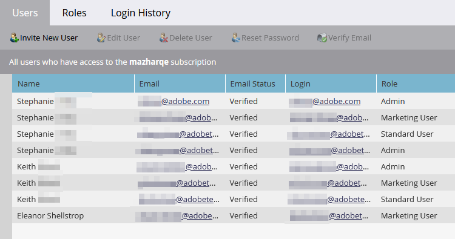

# E-mailverificatie {#email-verification}

Adobe Marketo Engage-abonnementen vereisen dat alle gebruikers die geen API gebruiken, inclusief Marketo Engage-beheerders, hun e-mailadres verifiëren. Aan gebruikers met een SSO (Single Sign-On) die geen beheerrol hebben toegewezen of die een rol met de machtiging SSO omzeilen hebben toegewezen, wordt hun e-mail automatisch geverifieerd wanneer hun abonnement is ingeschakeld met de functie E-mailverificatie.

## Uitnodiging gebruiker {#user-invite}

Wanneer een Admin een gebruiker uitnodigt, wordt die gebruiker automatisch geverifieerd zodra hij op de uitnodigingskoppeling klikt. SSO-gebruikers waaraan de beheerdersrol niet is toegewezen, worden automatisch geverifieerd.

## Verificatiebericht {#verification-email}

Gebruikers ontvangen de volgende e-mail wanneer e-mailverificatie wordt geactiveerd voor een abonnement of als deze wordt geactiveerd door een beheerder/gebruiker:

>[!NOTE]
>
>Als u een verificatiebericht opnieuw wilt verzenden aan een niet-geverifieerde gebruiker, selecteert u gewoon de desbetreffende record en klikt u op de knop **E-mail verifiëren** knop.

## Een e-mailadres wijzigen {#changing-an-email-address}

Wanneer het e-mailadres van een gebruiker wordt gewijzigd, wordt het niet geverifieerd. Er wordt een e-mail naar hen verzonden, zodat ze opnieuw kunnen verifiëren. Gebruikers kunnen de e-mail handmatig opnieuw verzenden door op **Verificatie opnieuw verzenden**.

## Gebruikers en rollen {#users-and-roles}

In **Beheer** > **Gebruikers en rollen** In de kolom E-mailstatus wordt de verificatiestatus van elke gebruiker weergegeven.

## Meerdere aanmeldings-id&#39;s voor gebruikers {#multiple-user-login-ids}

Er kan slechts één gebruikersaccount aan één e-mailadres worden gekoppeld. Als er meerdere gebruikersaccounts zijn gekoppeld aan één e-mailadres, vereist Marketo Engage dat het conflict wordt opgelost en dat alle gebruikersaanmeldingen worden weergegeven die aan het e-mailadres zijn gekoppeld, en drie oplossingsopties:

* Huidige e-mail gebruiken voor de huidige gebruikersnaam
* Nieuwe e-mail gebruiken voor de huidige gebruikersnaam
* De beslissing vertragen tot volgende aanmelding

   

>[!NOTE]
>
>Terwijl een gebruikersaccount aan één adres moet worden gekoppeld, kan een gebruikersaccount voor veel abonnementen worden gebruikt via Universal ID.
