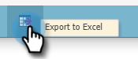

# Rollen en machtigingen exporteren {#export-roles-and-permissions}

Hier is hoe te om alle rollen en hun toestemmingen uit te voeren.

>[!NOTE]
>
>Beheerdersmachtigingen vereist

1. Ga naar het **[!UICONTROL Admin]** -gebied.

   

1. Selecteer **[!UICONTROL Users & Roles]**.

   

1. Klik op de tab **[!UICONTROL Roles]** .

   

1. Blader naar de onderkant van de pagina en klik op de knop Exporteren.

   

>[!NOTE]
>
>Zorg ervoor dat uw browser pop-ups van Marketo niet blokkeert.

De gegevens zullen als CSV uitvoeren en bevatten rollen, toestemmingen, en een telling van hoeveel toestemmingen per groep zijn toegelaten.

