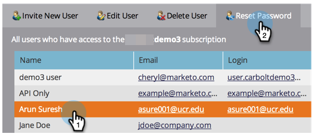

# Marketo-gebruikers beheren {#managing-marketo-users}

>[!IMPORTANT]
>
>Dit artikel is slechts voor degenen die _niet_ gebruiken [&#x200B; Marketo met de Identiteit van Adobe &#x200B;](/help/marketo/product-docs/administration/marketo-with-adobe-identity/adobe-identity-management-overview.md){target="_blank"}. Als u doet, te volgen gelieve de stappen in [&#x200B; dit artikel &#x200B;](/help/marketo/product-docs/administration/marketo-with-adobe-identity/add-or-remove-a-user.md){target="_blank"}.

## Gebruikers maken {#create-users}

1. Ga naar het **[!UICONTROL Admin]** -gebied.

   

1. Klik op **[!UICONTROL Users & Roles]**.

   

1. Klik op **[!UICONTROL Invite New User]**.

   

1. Voer **[!UICONTROL Email]**, **[!UICONTROL First Name]** en **[!UICONTROL Last Name]** in.

   

1. Voer eventueel een reden voor de uitnodiging in en selecteer een vervaldatum in het veld **[!UICONTROL Access Expires]** met de datumkiezer.

   

1. Klik op **[!UICONTROL Next]**.

   

   >[!TIP]
   >
   >Een vervaldatum is ideaal voor externe belanghebbenden of consultants voor de korte termijn die slechts voor een korte tijd toegang tot Marketo nodig hebben.

   >[!NOTE]
   >
   >Wanneer de vervaldatum aankomt, ontvangt de gebruiker een vervalmelding en is zijn account vergrendeld.

1. Selecteer de **[!UICONTROL Role]** van uw keuze en klik op **[!UICONTROL Next]** .

   

1. Bewerk indien nodig het uitnodigingsbericht. Klik **Se  en**.

   

   >[!NOTE]
   >
   >De e-mail/login moet uniek zijn; als u het reeds in een zandbakinstantie hebt gebruikt, zult u verschillende in productie en vice versa moeten gebruiken.

   

   >[!NOTE]
   >
   >Uitnodigingen verlopen drie dagen nadat een nieuwe gebruiker is toegevoegd.

De nieuwe gebruiker wordt nu vermeld op het tabblad Gebruikers en ontvangt een e-mail met instructies voor het activeren van hun account.

## Gebruikers verwijderen {#delete-users}

>[!NOTE]
>
>Als de gebruiker u wilt schrappen ook een gebruiker van Dynamic Chat is, moet u [&#x200B; hen uit Dynamic Chat &#x200B;](/help/marketo/product-docs/demand-generation/dynamic-chat/setup-and-configuration/add-or-remove-chat-users.md#remove-a-chat-user){target="_blank"} in Admin Console verwijderen alvorens u hen in Marketo Engage kunt schrappen.

1. Ga naar het **[!UICONTROL Admin]** -gebied.

   

1. Klik op **[!UICONTROL Users & Roles]**.

   

1. Selecteer de gebruiker die u wilt verwijderen en klik op **[!UICONTROL Delete User]** .

   

1. Bevestig door op **[!UICONTROL OK]** te klikken.

   

## Gebruikerswachtwoorden opnieuw instellen {#reset-user-passwords}

1. Ga naar het **[!UICONTROL Admin]** -gebied.

   

1. Klik op **[!UICONTROL Users & Roles]**.

   

1. Selecteer een gebruiker en klik op **[!UICONTROL Reset Password]** .

   

1. Klik op **[!UICONTROL Close]** om de vraag te sluiten.

   

De gebruiker ontvangt een e-mail met instructies voor het opnieuw instellen van het wachtwoord.

>[!TIP]
>
>Als de gebruiker het e-mailbericht niet ziet in zijn postvak, vraagt u hem of haar de map junk/spam te controleren.

## Machtigingen wijzigen en Gebruikersgegevens bewerken {#change-permissions-and-edit-user-information}

1. Ga naar het **[!UICONTROL Admin]** -gebied.

   

1. Klik op **[!UICONTROL Users & Roles]**.

   

1. Selecteer een gebruiker en klik op **[!UICONTROL Edit User]** .

   

1. U kunt gebruikersgegevens bewerken en de bijbehorende rol wijzigen. Klik op **[!UICONTROL Save]**.

   

>[!CAUTION]
>
>Als u de enige beheerder in Marketo bent, moet u uw eigen beheerdersrechten niet verwijderen.

>[!NOTE]
>
>Als een nieuwe gebruiker is uitgenodigd als beheerder of als een beheerder wordt verwijderd, ontvangen alle huidige beheerders een e-mailbericht.

Geweldig werk! U weet nu hoe u een gebruiker kunt maken, een gebruiker kunt verwijderen, het wachtwoord van een gebruiker opnieuw kunt instellen en gebruikers kunt bewerken.
