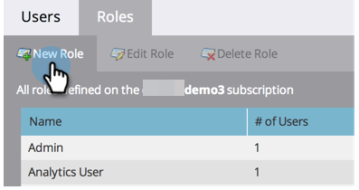
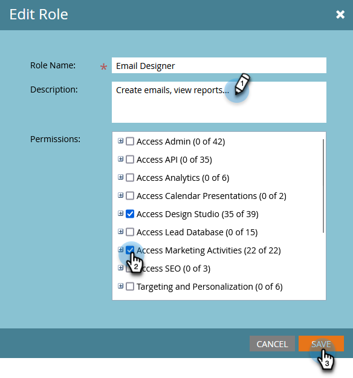
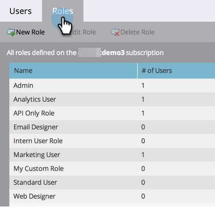

# Gebruikersrollen en -machtigingen beheren {#managing-user-roles-and-permissions}

U kunt gebruikersrollen instellen, maken en bewerken en deze aan gebruikers toewijzen. Op deze manier kunt u de gebieden en functionaliteit bepalen waartoe elke Marketo-gebruiker toegang heeft.

Een marketinggebruiker heeft bijvoorbeeld doorgaans brede toegang nodig in de toepassing om e-mails, landingspagina&#39;s en programma&#39;s te maken, te wijzigen en te implementeren. Een webontwerper daarentegen besteedt bijna al zijn tijd in de Design Studio aan het maken van elementen voor gebruik in e-mails en landingspagina&#39;s. En terwijl de bedrijfsleiders uitgebreid gebruik maken van Marketo rapporten op het gebied van Analytics, kunnen zij niet de activa of de programma&#39;s zelf moeten creëren of drijven.

>[!NOTE]
>
>**Vereiste Bevoegdheden Admin**

Marketo biedt verschillende ingebouwde rollen met verschillende toegangsniveaus:

* **Admin** - alle delen van de toepassing, met inbegrip van de Admin sectie
* **Standaard Gebruiker** - alle delen van de toepassing, behalve de sectie Admin
* **Gebruiker van de Marketing** - alle delen van de toepassing, behalve de Admin sectie
* **Designer van het Web** - slechts de Studio van het Ontwerp
* **Gebruiker van Analytics** - slechts de sectie van Analytics

U kunt de rollen Admin en Standaard van de Gebruiker niet uitgeven, maar u kunt anderen uitgeven. U kunt nieuwe douanerollen ook tot stand brengen om de bepaalde organisatorische structuren in uw bedrijf aan te passen.

## Marketo met Adobe-id {#marketo-with-adobe-identity}

Als u Marketo met de Identiteit van de Adobe gebruikt, kan de lijst van profielbeschrijvingen [ hier ](/help/marketo/product-docs/administration/marketo-with-adobe-identity/adobe-identity-management-overview.md#profile-levels) worden gevonden.

## Rollen toewijzen aan een gebruiker {#assign-roles-to-a-user}

U kunt rollen aan een gebruiker toewijzen wanneer u [ gebruikers voor het eerst ](/help/marketo/product-docs/administration/users-and-roles/create-delete-edit-and-change-a-user-role.md) creeert of door [ het uitgeven van een bestaande gebruiker ](/help/marketo/product-docs/administration/users-and-roles/managing-marketo-users.md).

1. Ga naar het **[!UICONTROL Admin]** -gebied.

   

1. Klik op **[!UICONTROL Users & Roles]**.

   

1. Selecteer in de lijst de gebruiker die u wilt bewerken en klik op **[!UICONTROL Edit User]** .

   

1. Selecteer onder **[!UICONTROL Roles]** de rollen die u aan de gebruiker wilt toewijzen op basis van de machtigingen die deze nodig heeft en klik op **[!UICONTROL Save]** .

   

   >[!NOTE]
   >
   >Om over elke rol te leren, zie [ Beschrijvingen van de Toestemmingen van de Rol ](/help/marketo/product-docs/administration/users-and-roles/descriptions-of-role-permissions.md).

## Een nieuwe rol maken {#create-a-new-role}

Soms, heeft uw organisatie werknemers in zeer specifieke rollen die een douanecombinatie van toestemmingen vereisen.

1. Ga naar het **[!UICONTROL Admin]** -gebied.

   

1. Klik op **[!UICONTROL Users & Roles]**.

   

1. Klik op de tab **[!UICONTROL Roles]** .

   

1. Klik op **[!UICONTROL New Role]**.

   

1. Voer een **[!UICONTROL Role Name]** , een **[!UICONTROL Description]** (optioneel) in en selecteer de machtigingen die gebruikers met deze rol nodig hebben.

   

## Een rol bewerken {#edit-a-role}

Als u de toestemmingen moet veranderen die met een bestaande rol worden geassocieerd, kunt u de rol uitgeven.

1. Ga naar het **[!UICONTROL Admin]** -gebied.

   

1. Klik op **[!UICONTROL Users & Roles]**.

   

1. Klik op de tab **[!UICONTROL Roles]** .

   

1. Selecteer in de lijst de rol die u wilt wijzigen en klik op **[!UICONTROL Edit Role]** .

   

1. Wijzig **[!UICONTROL Role Name]** en **[!UICONTROL Description]** indien nodig de selectie van de gekoppelde **[!UICONTROL Permissions]** en klik op **[!UICONTROL Save]** als u klaar bent.

   

   >[!NOTE]
   >
   >Gebruikers die over de rol beschikken die u hebt bewerkt, ontvangen de gewijzigde machtigingen nadat zij zich hebben afgemeld en opnieuw zijn aangemeld.

## Een rol verwijderen {#delete-a-role}

Als een rol onnodig wordt, kunt u deze verwijderen.

1. Ga naar het **[!UICONTROL Admin]** -gebied.

   

1. Klik op **[!UICONTROL Users & Roles]**.

   

1. Klik op de tab **[!UICONTROL Roles]** .

   

1. Selecteer in de lijst de rol die u wilt verwijderen en klik op **[!UICONTROL Delete Role]** .

   

1. Klik op **[!UICONTROL Delete]** om te bevestigen.

   
