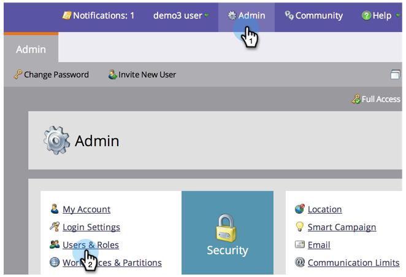
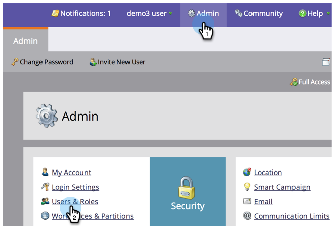

# Gebruikersrollen en -machtigingen beheren {#managing-user-roles-and-permissions}

U kunt gebruikersrollen instellen, maken en bewerken en deze aan gebruikers toewijzen. Dit staat u toe om de gebieden en de functionaliteit te controleren die elke gebruiker van het Markeren toegang heeft tot.

Een marketinggebruiker heeft bijvoorbeeld doorgaans brede toegang nodig in de toepassing om e-mails, landingspagina&#39;s en programma&#39;s te maken, te wijzigen en te implementeren. Een webontwerper daarentegen besteedt bijna al zijn tijd in de Design Studio aan het maken van elementen voor gebruik in e-mails en landingspagina&#39;s. En hoewel de bedrijfsleiders uitgebreid gebruik maken van de rapporten van Marketo op het gebied van Analytics, kunnen zij niet de activa of de programma&#39;s zelf moeten creëren of drijven.

>[!NOTE]
>
>**Beheerdersmachtigingen vereist**

Marketo biedt verschillende ingebouwde rollen met verschillende toegangsniveaus:

* **Admin **- alle onderdelen van de toepassing, inclusief de sectie Admin
* **Standaardgebruiker **- alle onderdelen van de toepassing, behalve de sectie Admin
* **Gebruiker** voor het in de handel brengen - alle delen van de toepassing, behalve de Admin sectie
* **Webontwerper **- alleen de Design Studio
* **Analytics-gebruiker **- alleen de sectie Analytics

U kunt de rollen Admin en Standaard van de Gebruiker niet uitgeven, maar u kunt anderen uitgeven. U kunt nieuwe douanerollen ook tot stand brengen om de bepaalde organisatorische structuren in uw bedrijf aan te passen.

## Rollen toewijzen aan een gebruiker {#assign-roles-to-a-user}

U kunt rollen aan een gebruiker toewijzen wanneer u gebruikers voor het eerst  creeert of door een bestaande gebruiker uit te geven.

1. Als u een bestaande gebruiker wilt bewerken, gaat u naar **Beheer** en klikt u op **Gebruikers en rollen**.

   

1. Selecteer in de lijst de gebruiker die u wilt bewerken en klik op Gebruiker **** bewerken.

   

1. Selecteer onder **Rollen** de rollen die u aan de gebruiker wilt toewijzen op basis van de machtigingen die deze nodig heeft, en klik op **Opslaan**.

   

   >[!NOTE]
   >
   >Zie [Beschrijving van Rolmachtigingen](managing-user-roles-and-permissions/descriptions-of-role-permissions.md)voor meer informatie over elke rol.

## Een nieuwe rol maken {#create-a-new-role}

Soms, heeft uw organisatie werknemers in zeer specifieke rollen die een douanecombinatie van toestemmingen vereisen.

1. Als u een nieuwe gebruikersrol wilt maken, gaat u naar Beheer en klikt u op Gebruikers en rollen.

   

1. Klik op het tabblad Rollen.

   

1. Klik op Nieuwe rol.

   

1. Voer een rolnaam, een beschrijving (optioneel) in en selecteer de machtigingen die gebruikers in deze rol nodig hebben.

   

## Een rol bewerken {#edit-a-role}

Als u de toestemmingen moet veranderen die met een bestaande rol worden geassocieerd, kunt u de rol uitgeven.

1. Ga naar **Beheer** en klik op **Gebruikers en rollen**.

   

1. Klik op het tabblad **Rollen **tab.

   

1. Selecteer in de lijst de rol die u wilt wijzigen en klik op Rol **** bewerken.

   

1. Wijzig indien nodig de naam **en beschrijving van de** rol **Beschrijving en wijzig vervolgens de selectie van de bijbehorende **machtigingen**.

   

   >[!NOTE]
   >
   >Gebruikers die over de rol beschikken die u hebt bewerkt, ontvangen de gewijzigde machtigingen nadat zij zich hebben afgemeld en opnieuw zijn aangemeld.

## Een rol verwijderen {#delete-a-role}

Als een rol onnodig wordt, kunt u deze verwijderen.

1. Ga naar Beheer en klik op Gebruikers en rollen.

   

1. Klik op het tabblad Rollen.

   

1. Selecteer in de lijst de rol die u wilt verwijderen en klik op Rol verwijderen.

   

1. Klik ter bevestiging op Verwijderen.

   

>[!NOTE]
>
>**Verwante artikelen**
>
>Meer informatie over het maken van extra gebruikers en het toewijzen van hun rollen in Aan de [slag met Marketo](../../../getting-started.md).

>[!NOTE]
>
>**Diep duiken**
>
>Meer informatie over andere beheertaken vindt u in de diepe map [Admin](http://docs.marketo.com/display/docs/administration) .
