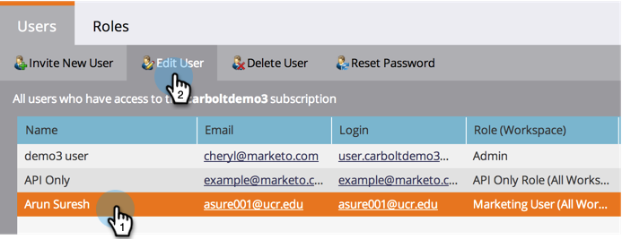

# Toegang van gebruikers tot een werkruimte toestaan {#allow-user-access-to-a-workspace}

De werkruimten kunnen om het even welke reden (zoals bedrijfseenheid of geografische scheiding) zijn. Ze scheiden de elementen (slimme lijsten, programma&#39;s, enz.) van elk team. Hieronder wordt beschreven hoe u een gebruiker toegang geeft tot een of meer werkruimten.

>[!NOTE]
>
>**Beheerdersmachtigingen vereist**

>[!NOTE]
>
>Meer informatie over [werkruimten](/help/marketo/product-docs/administration/workspaces-and-person-partitions/understanding-workspaces-and-person-partitions.md).

1. Klik onder Beheer op Gebruikers en rollen.

1. Selecteer de gebruiker onder het tabblad **Gebruikers** en klik op **Gebruiker bewerken**.

   

1. Selecteer **Rol en Werkruimte** u de gebruiker toegang tot wilt hebben.

   >[!NOTE]
   >
   >U kunt uw gebruikers toestaan om het even welke combinatie toegang tot werkruimten te hebben.

   

1. Nadat u de wijzigingen hebt opgeslagen, wordt de update weergegeven.

   

Geweldig! Als ze zich nu aanmelden, zien ze alle werkruimten die ze toegang gaven.
