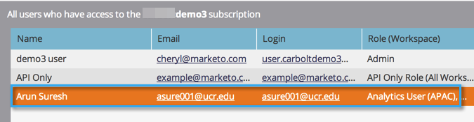

# Gebruikerstoegang tot een Workspace toestaan {#allow-user-access-to-a-workspace}

De werkruimten kunnen om het even welke reden (zoals bedrijfseenheid of geografische scheiding) zijn. Ze scheiden de middelen (slimme lijsten, programma&#39;s, enz.) van elk team. Hieronder wordt beschreven hoe u een gebruiker toegang geeft tot een of meer werkruimten.

>[!NOTE]
>
>**Vereiste Bevoegdheden Admin**

>[!NOTE]
>
>Leer meer over [&#x200B; werkruimten &#x200B;](/help/marketo/product-docs/administration/workspaces-and-person-partitions/understanding-workspaces-and-person-partitions.md).

1. Ga naar het **[!UICONTROL Admin]** -gebied.

   

1. Klik op **[!UICONTROL Users & Roles]**.

   

1. Selecteer de gebruiker onder het tabblad **[!UICONTROL Users]** en klik op **[!UICONTROL Edit User]** .

   

1. Selecteer de **[!UICONTROL Roles and Workspaces]** waartoe de gebruiker toegang moet hebben.

   

   >[!NOTE]
   >
   >U kunt uw gebruikers elke combinatie van toegang tot werkruimten toestaan.

Nadat u de wijzigingen hebt opgeslagen, wordt de update weergegeven.

