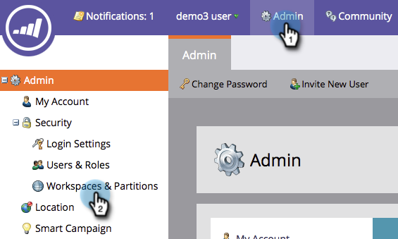

# De naam van een werkruimte wijzigen {#change-the-name-of-a-workspace}

>[!NOTE]
>
>**Beheerdersmachtigingen vereist**

>[!PREREQUISITES]
>
>[Een nieuwe werkruimte maken](/help/marketo/product-docs/administration/workspaces-and-person-partitions/create-a-new-workspace.md)

Gebruikers kunnen de naam van een werkruimte wijzigen. Het is vrij eenvoudig.

>[!NOTE]
>
>Begrijp eerst met [het Begrijpen van Werkruimten en Partities van de Persoon](/help/marketo/product-docs/administration/workspaces-and-person-partitions/understanding-workspaces-and-person-partitions.md).

1. Klik onder **Admin** op **Werkruimten en partities.**

   

1. Selecteer de werkruimte en klik op **Werkruimte bewerken**.

   

1. Voer een nieuwe **Naam** voor uw werkruimte in en klik op **Opslaan.**

   

1. Nadat u het bestand hebt opgeslagen, ziet u de wijzigingen.

   
