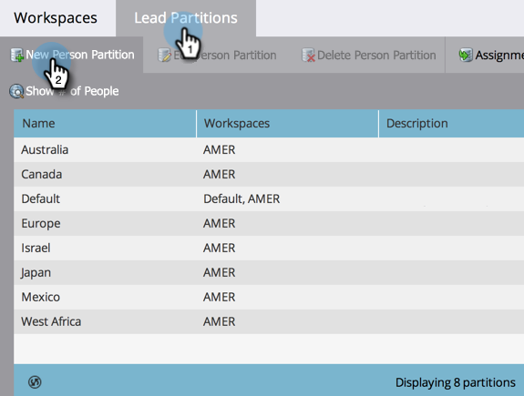

# Een personenpartitie maken {#create-a-person-partition}

Creeer een nieuwe persoonverdeling na deze stappen.

>[!NOTE]
>
>**Vereiste Bevoegdheden Admin**

>[!NOTE]
>
>Begrijp eerst met [ Begrijpend Werkruimten en de Verdelingen van de Persoon ](/help/marketo/product-docs/administration/workspaces-and-person-partitions/understanding-workspaces-and-person-partitions.md).

1. Ga naar het **[!UICONTROL Admin]** -gebied.

   

1. Klik op **[!UICONTROL Workspaces & Partitions]**.

   

1. Ga naar de tab **[!UICONTROL Person Partitions]** en klik op **[!UICONTROL New Person Partition]** .

   

1. Geef de partitie een naam, kies de locatie **[!UICONTROL Workspaces]** waar de partitie wordt weergegeven en klik op **[!UICONTROL Create]** .

   

Na het creëren van de verdeling, zou u de update moeten zien.

